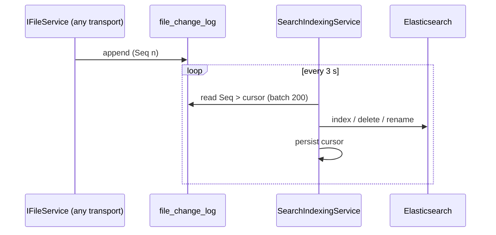

# Background Services

This document lists the long-running workers of each process and the coordination patterns they
use. Several workers are deliberately **single-owner**: they are registered in exactly one process so
that a shared cursor or queue has one writer.

Related: [System overview](system-overview.md) · [Storage and persistence](storage-and-persistence.md) ·
[Search indexing](../subsystems/search-indexing.md) · [Mail notifications](../subsystems/mail-notifications.md)

## Per process

### Host (`src/Kaimo_File_Server.Host/Program.cs`)

| Service | Purpose |
|---|---|
| `DataServiceReconciler` | Every 5 s, applies the desired state `services.{key}.enabled` from `config_settings` to each `IManagedDataService` and writes back `services.{key}.status`. For SMB, `SambaSmbControlService` reflects the flag; the bridge enforces it by denying tree connects while SMB is disabled |
| `DatabaseBackupSchedulerService` | One `pg_dump` per day inside a configured local-time window, with catch-up after downtime; woken immediately when backup settings change |
| `VersionStorageReconcilerService` | Moves version blobs from the legacy application-data store into the pools of their shares and follows shares moved to another pool (shortly after start, then daily) |

Before the services start, the Host runs the writable-directory preflight, `MigrateSeedAndBackupAsync`
(optional restore, pre-migration backup, migrations, seeding) and initializes the Elasticsearch index
mapping.

### Web (`src/Kaimo_File_Server.Web/Program.cs`)

| Service | Purpose |
|---|---|
| `SearchIndexingService` | **Single owner** of all Elasticsearch writes. Tails `file_change_log` in batches of 200 from a cursor persisted in `config_settings`; does not advance the cursor while Elasticsearch is disabled or unreachable |
| `NotificationDispatcherService` | **Single owner** of mail delivery. Leases `notification_events`, applies mail rules, renders and sends via SMTP, retries with backoff, prunes old rows |
| `ClientSyncRetentionService` | Every 6 h, prunes `file_change_log`, `client_request_receipts` and expired refresh tokens |
| `CloudSyncSchedulerService` | Evaluates enabled sync schedules and enqueues due syncs; woken immediately when a sync definition changes |
| `CloudSyncJobRunner` | Background job queue that executes manual and scheduled syncs off the request thread and reports progress |
| `LegacyCloudSyncMigrationHostedService` | Once at startup, imports sync definitions stored in the legacy share-embedded format before scheduled sync work begins |
| `CertificateRenewalService` | Shortly after start and then daily, renews the self-signed HTTPS certificate when it enters its renewal window |
| `SecurityMonitorFlushService` | Persists batched login and request activity of `SecurityMonitor` and prunes old records |

### SmbBridge (`src/Kaimo_File_Server.SmbBridge/Program.cs`)

| Service | Purpose |
|---|---|
| `SnapshotCacheCleanupService` | Evicts @GMT snapshot cache entries by TTL and per-share size cap, skipping entries held by an active lease |
| `SambaEventReceiptCleanupService` | Every 6 h, deletes lifecycle-event receipts older than `LifecycleEvents__ReceiptRetentionDays` (default 30) |

### All .NET processes

| Service | Purpose |
|---|---|
| `LoggingLevelReloader` (via `AddDynamicLogLevel`) | Polls the global log level from the database every 15 s and applies it live |
| Log archive writer (via `AddLogArchive`) | Writes structured log entries to `/data/kaimo-logs/<source>/` with rotation and retention |

### Samba container

Not .NET services, but long-running loops supervised by `src/samba-vfs/supervise-samba.sh`:
`kaimo_authd` and the periodic user, share and configuration sync jobs. See
[Samba VFS integration](../smb/samba-vfs-integration.md).

## Coordination patterns

### Change-log tailing

File operations append to `file_change_log` and return immediately. Derived stores are updated by
readers that keep their own cursor:

Elasticsearch outages therefore never block or fail a file operation; the log buffers changes until
the indexer catches up. A full manual reindex rebuilds the index from the file system.

### Transactional outbox

Any process writes `notification_events` rows. Only the Web process, which can decrypt the SMTP
credential, claims them with a time-limited lease, so a crashed dispatcher's work is picked up again
after the lease expires.

### Desired-state reconciliation

Administrators change desired state in `config_settings`; reconcilers in the owning process converge
the runtime to it and publish status back. No process calls another to switch a service on or off.

### Durable SMB events

SMB lifecycle events are spooled to disk inside the Samba container, delivered to the bridge with
retries and deduplicated by event ID through `samba_lifecycle_event_receipts`. See
[SMB lifecycle events and snapshots](../smb/lifecycle-events-and-snapshots.md).
