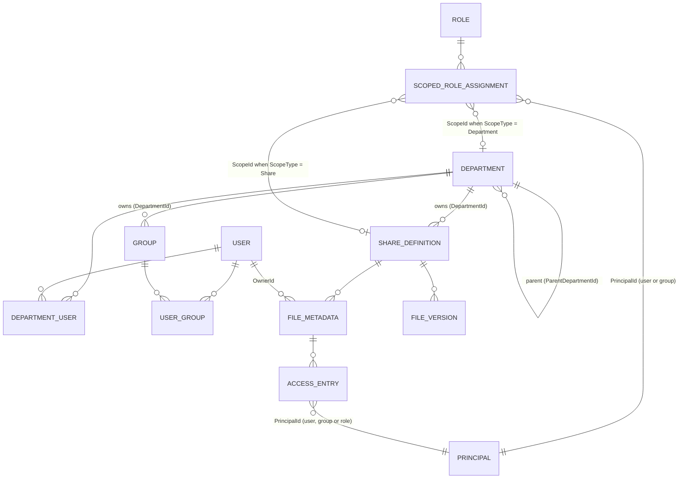
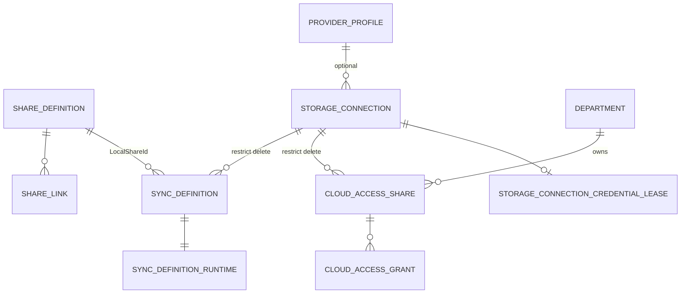
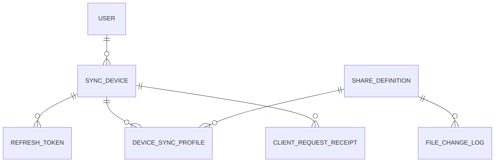

# Domain Model

This document describes the core entities and their relationships. Entities live in
`src/Kaimo_File_Server.Core/Domain/` and `src/Kaimo_File_Server.Core/Security/`; their table
mappings are in `src/Kaimo_File_Server.Infrastructure/Persistence/ApplicationDbContext.cs`.

Related: [Storage and persistence](storage-and-persistence.md) · [Security model](security-model.md)

## Identity, organization and permissions

| Entity | Table | Notes |
|---|---|---|
| `User`, `Group`, `Role` | `users`, `groups`, `roles` | All derive from `Identity` (`Id`, `Name`) and can act as ACL principals |
| `UserGroup` | `user_groups` | Many-to-many user ↔ group membership |
| `Department` | `departments` | Hierarchical via `ParentDepartmentId`. The global department has the fixed ID `WellKnownGUIDs.DEPARTMENT_GLOBAL` |
| `DepartmentUser` | `department_users` | Many-to-many user ↔ department membership |
| `ScopedRoleAssignment` | `scoped_role_assignments` | Assigns a role to a user or group with `ScopeType` `Global`, `Department` or `Share` and a `ScopeId`. This is the only way roles are assigned |
| `ShareDefinition` | `share_definitions` | A directory in a storage pool, owned by exactly one department |
| `FileMetadata` | `file_metadata` | One row per file or folder that carries an owner or ACL entries. The share root has `Path = ""` and must exist for root-level ACLs |
| `AccessEntry` | `access_entries` | Allow or deny entry with a `FilePermission` bitmask and `AclInheritance` flags |
| `FileVersion` | `file_versions` | Historical version, keyed by `ShareId` + `FilePath`, pointing to a blob (`StoragePath`) |

Groups and shares belong to exactly one department (`DepartmentId`). The system groups **Admins**
(`WellKnownGUIDs.GROUP_ADMINS`) and **Everyone** (`WellKnownGUIDs.GROUP_EVERYONE`) have fixed IDs and
cannot be deleted. Every user is a member of Everyone; membership in Admins mirrors the global
administrator role.

## Sharing and external storage

| Entity | Table | Notes |
|---|---|---|
| `ShareLink` | `share_links` | Public link into a share subtree. `Kind` distinguishes download links and upload links |
| `ProviderProfile` | `provider_profiles` | Provider application identity (for example a Microsoft or Google client registration) |
| `StorageConnection` | `storage_connections` | One authorized account or endpoint at an external provider. Credentials are stored encrypted |
| `SyncDefinition` / `SyncDefinitionRuntime` | `sync_definitions`, `sync_definition_runtimes` | Server-side sync between a connection and a local share path; runtime holds mutable run state |
| `CloudAccessShare` / `CloudAccessGrant` | `cloud_access_shares`, `cloud_access_grants` | Virtual share exposing a remote folder through a connection, with whole-share grants per principal |

See [External storage](../external-storage/connections-and-credentials.md).

## Client devices

| Entity | Table | Notes |
|---|---|---|
| `SyncDevice` | `sync_devices` | A registered client app installation |
| `RefreshToken` | `refresh_tokens` | Per-device rotating refresh token chain (`ReplacedByTokenId`) |
| `DeviceSyncProfile` | `device_sync_profiles` | Which share subtree a device mirrors to which local path |
| `ClientRequestReceipt` | `client_request_receipts` | Stored responses for `Idempotency-Key` replays |
| `FileChangeLogEntry` | `file_change_log` | Append-only per-share change feed |

See [REST API v1](../external-access/rest-api.md).

## Notifications

| Entity | Table | Notes |
|---|---|---|
| `NotificationEvent` | `notification_events` | Outbox row written by any process |
| `MailRule` | `mail_rules` | Event type → recipients mapping |
| `MailTemplate` | `mail_templates` | Per event and language template override |
| `MailDelivery` | `mail_deliveries` | One row per recipient and send attempt state |

See [Mail notifications](../subsystems/mail-notifications.md).
