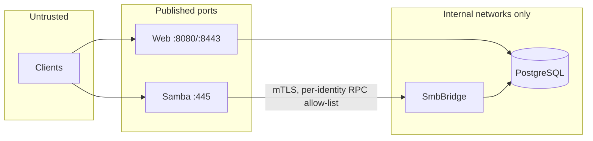

# Security Model

This document describes how Kaimo File Server authenticates callers, authorizes file and
administrative operations, and protects secrets at rest and in transit.

Related: [System overview](system-overview.md) · [Domain model](domain-model.md) ·
[SMB control plane](../smb/control-plane-grpc.md) · [REST API v1](../interfaces/rest-api-v1.md)

## Trust boundaries

- Only the Web host (HTTP/HTTPS) and Samba (SMB) accept external connections. Elasticsearch and
  Adminer are bound to loopback.
- The database and the SMB control plane sit on `internal` Docker networks.
- Every file operation, regardless of protocol, is authorized by the same `IAclService` in Core.

## Authentication

| Channel | Mechanism | Implementation |
|---|---|---|
| Web UI (Blazor Server) | Username/password → JWT held in browser `localStorage`; logout revokes the token ID (`jti`) in `revoked_web_tokens` | `src/Kaimo_File_Server.Web/Services/JwtTokenService.cs`, `JwtAuthenticationStateProvider.cs` |
| REST API `/api/v1` | Device-scoped JWT bearer + rotating refresh tokens | `src/Kaimo_File_Server.Web/Controllers/Api/AuthApiController.cs`, `Services/Api/ApiTokenService.cs` |
| WebDAV `/dav` | HTTP Basic (verified against the user store) or the device-scoped JWT bearer | `src/Kaimo_File_Server.Web/Controllers/WebDav/WebDavBasicAuthenticationHandler.cs` |
| SMB | NTLMv2 by Samba against NT hashes provisioned from the database | [SMB control plane](../smb/control-plane-grpc.md) |
| Public share links | Unguessable token in the URL, no account | [Downloads and share links](../interfaces/downloads-and-share-links.md) |

Common rules:

- **Passwords** are hashed with BCrypt (`src/Kaimo_File_Server.Infrastructure/PasswordService.cs`).
  Empty passwords are rejected; failed and successful checks take comparable time so usernames
  cannot be enumerated.
- **Lockout.** `LoginThrottle` (`src/Kaimo_File_Server.Core/Security/LoginThrottle.cs`) locks a key
  after consecutive failures (defaults: 5 attempts, 15 minutes, configurable in `config_settings`).
  The state is held in process memory.
- **JWT.** Tokens are HMAC-SHA256 with the algorithm pinned during validation. `JwtTokenService.ValidateSecret`
  refuses to start with a short secret, a known public default, or a development secret outside the
  Development environment. Every token carries the account's `SecurityStamp`; changing the password
  rotates the stamp and invalidates all earlier tokens.
- **Bearer validation.** `BearerTokenValidation.ValidateAsync` (`src/Kaimo_File_Server.Web/Services/BearerTokenValidation.cs`)
  runs on every bearer-authenticated request: the token must be device-scoped (the web login token is
  not accepted), the device active, the account enabled and the security stamp current.
- **Security monitor.** `SecurityMonitor` records every credential check (web, API, WebDAV) and counts
  API/WebDAV requests per client into `login_attempts` and `client_activity`.
- There is no directory-service (LDAP/Active Directory/Kerberos) integration; all accounts are local.

## File authorization (ACL)

`AclService` (`src/Kaimo_File_Server.Core/Security/AclService.cs`) evaluates access in this order:

1. An explicit **Deny** entry on the item or an inherited ancestor entry denies.
2. An explicit **Allow** entry grants.
3. The share's **department default** grants baseline access to members of the share's department
   (walking the department hierarchy). Defaults are evaluated at runtime and never materialized as
   `AccessEntry` rows.
4. Otherwise access is denied.

- **Permissions** are an NTFS-like `long` bitmask (`FilePermission` in
  `src/Kaimo_File_Server.Core/Security/FilePermissions.cs`): `TraverseExecute`, `ListReadData`,
  `ReadAttributes`, `ReadExtAttributes`, `ReadPermissions`, `CreateWriteData`, `CreateAppendData`,
  `WriteAttributes`, `WriteExtAttributes`, `DeleteSubItems`, `Delete`, `ChangePermissions`,
  `TakeOwnership`, with the aggregates `ReadAll`, `WriteAll`, `AdminAll`, `FullControl`.
- **Inheritance** flags (`AclInheritance`): `ThisFolder`, `SubFolders`, `SubFiles`, `AllDescendants`.
- **Principals** are users, groups or roles.
- **Owner.** The creator of an item is recorded as `FileMetadata.OwnerId`.
- **SMB mapping.** The VFS module sends the raw SMB access mask; the bridge maps it to
  `FilePermission`, evaluates it with the same service and returns the granted mask.
- **Search results** are filtered through `SearchAclFilter` (`src/Kaimo_File_Server.Search/SearchAclFilter.cs`).

## Administrative authorization

- `ManagementPermission` (`src/Kaimo_File_Server.Core/Security/ManagementPermission.cs`) is a `long`
  flags enum covering users, groups, roles, departments, shares, ACLs, home folders, share and upload
  links, system settings, data services, certificates, logs, backups, security monitor, mail,
  syncs, Cloud Access, connections and client devices.
- Roles carry a `ManagementPermission` set and are assigned through `ScopedRoleAssignment` with scope
  `Global`, `Department` or `Share`. `ManagementAuthService` and `DepartmentPermissionService`
  (`src/Kaimo_File_Server.Core/Services/`) resolve the effective permission for a scope.

## Secrets and key material

| Secret | Source | Used by | Protection |
|---|---|---|---|
| `Jwt__Secret` | Environment (`JWT_SECRET`) | Web | Validated at startup (length, public defaults) |
| `NtHash__EncryptionKey` | Environment (`NT_HASH_ENCRYPTION_KEY`) | Host, Web, SmbBridge (must be identical) | AES-256-GCM over stored NT hashes (`AesGcmNtHashProtector`); `NtHashKeyCanary` detects a mismatched key at startup |
| Data Protection key ring | `/data/kaimo-system/.dp-keys` | Web | Encrypted with a key-encryption certificate (`DataProtection:CertificatePath` or generated in `.dp-certificate/`) |
| Connection credentials, SMTP password | Database | Web | `ICredentialVault` → `DataProtectionCredentialVault`; ciphertext bound to connection ID, provider ID, credential kind and format version |
| Share-link tokens | Database | Web | Looked up by SHA-256 hash; the displayable token is stored encrypted with Data Protection (`ShareLinkTokenProtector`) |
| HTTPS certificate | `/data/kaimo-system/.certs/` | Web | Data Protection |
| SMB control-plane PKI | `secrets/smb-control-plane/` | Samba, SmbBridge | File permissions, mounted read-only per container |

`CredentialRewrapService` upgrades credential envelopes written in an older vault format at Web startup.

Because database secrets are encrypted with the Data Protection key ring, the database, the key ring
and the key-encryption certificate must always be backed up and restored together.

## Transport security

- Kestrel serves HTTP on 8080 and HTTPS on 8443 with a self-signed, automatically renewed certificate
  (`src/Kaimo_File_Server.Web/Services/Https/`), replaceable by an uploaded certificate. HSTS is
  enabled outside Development.
- `SecurityHeadersMiddleware` (`src/Kaimo_File_Server.Web/DynamicHelpers/SecurityHeadersMiddleware.cs`)
  sets a Content-Security-Policy, `X-Content-Type-Options: nosniff` and `Referrer-Policy: no-referrer`.
- `ForwardedHeadersSetup` trusts `X-Forwarded-For`/`-Proto` only from configured
  `ForwardedHeaders:KnownProxies`/`KnownNetworks` (default: loopback only; a reverse proxy must be listed explicitly).
- Rate limiting: a token-bucket policy on the search API; `HashExportRateLimiter` on the bridge's NT
  hash export.
- The SMB control plane uses mutual TLS with per-identity RPC allow-lists.

## Read-only demo mode

`KAIMO_DEMO_READONLY=true` on the Web and SmbBridge processes turns the instance into a
look-but-don't-touch demo (`src/Kaimo_File_Server.Infrastructure/ServiceCollectionExtensions.cs`):

1. `DemoModeOptions.ReadOnly` lets front ends hide write actions.
2. `ReadOnlyDemoSaveInterceptor` blocks every EF Core save.
3. `ReadOnlyDemoAclService` wraps `IAclService` and denies every permission with a non-read bit.

The Host never runs in demo mode so migrations, seeding and backups keep working.

## Startup preflight

`WritableDirectoryCheck` (`src/Kaimo_File_Server.Infrastructure/Startup/WritableDirectoryCheck.cs`)
verifies at startup (outside Development) that every mounted data directory is writable by the
non-root container user and fails fast with an actionable message otherwise.
