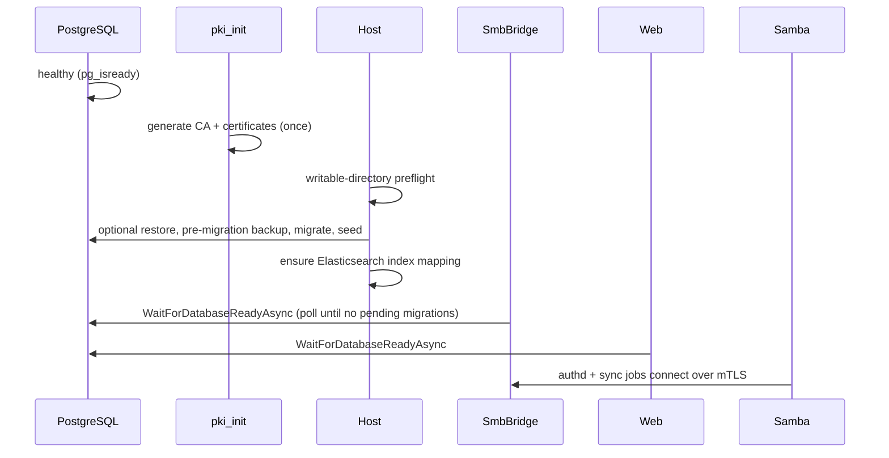
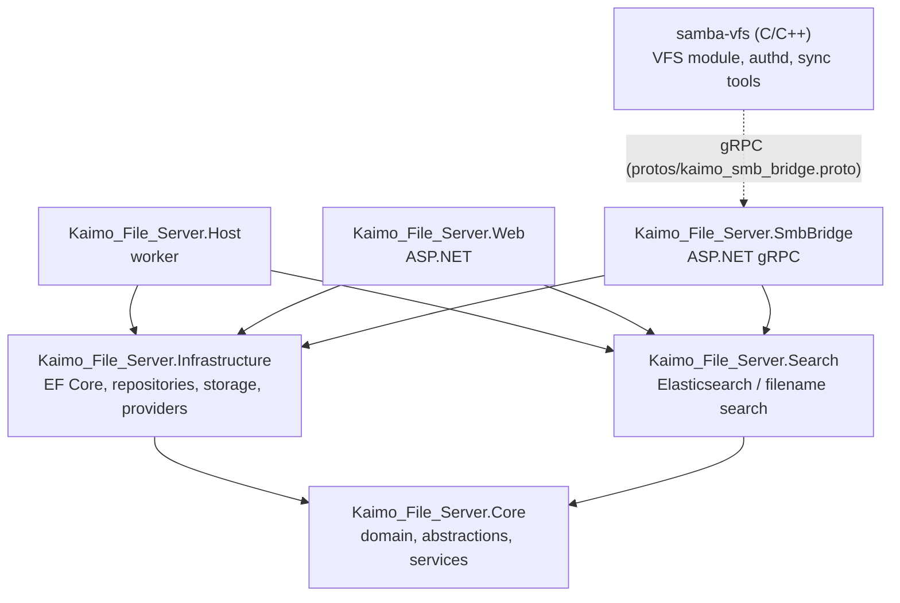

# System Overview

This document describes how Kaimo File Server is assembled at runtime: the containers, the networks
between them, the mounted volumes, the startup order, and how the .NET and native code is layered.
Code paths are relative to the repository root (`Kaimo_File_Server/`).

Related: [Storage and persistence](storage-and-persistence.md) ·
[Security model](security-model.md) · [Background services](background-services.md) ·
[Samba VFS integration](../external-access/smb/samba-vfs-integration.md)

## Runtime topology

The system runs as a Docker Compose stack (`docker-compose.yml`). Development overrides live in
`docker-compose.dev.yml`, which must be passed explicitly with `-f`.

```mermaid
flowchart LR
    subgraph clients[Clients]
        smbc[SMB clients]
        http[Browsers / REST / WebDAV clients]
    end

    subgraph default[network: default]
        samba["kaimo_samba<br/>smbd + VFS module + kaimo_authd"]
        web["kaimo_file_server_web<br/>ASP.NET: Blazor, REST, WebDAV"]
        host["kaimo_file_server<br/>Host worker (DB owner)"]
        es[(Elasticsearch)]
    end

    bridge["kaimo_smb_bridge<br/>gRPC control plane"]
    db[(PostgreSQL<br/>kaimo_file_server)]
    pools[(Storage pools<br/>/data/storage/*)]

    smbc -- "SMB :445" --> samba
    http -- "HTTP :8081 / HTTPS :8443" --> web
    samba -- "gRPC + mTLS :5080<br/>(kaimo_smb_control)" --> bridge
    bridge -- "kaimo_bridge_database" --> db
    web -- "kaimo_database" --> db
    host -- "kaimo_database" --> db
    web --> es
    host --> es
    samba --- pools
    web --- pools
    host --- pools
    bridge --- pools
```

| Service (container) | Built from | Role | Published ports | Networks |
|---|---|---|---|---|
| `kaimo_smb_pki_init` | `src/samba-vfs/Dockerfile.pki` | One-shot generation of the control-plane mTLS PKI into `data/smb-control-plane` | – | default |
| `kaimo_file_server.host` (`kaimo_file_server`) | `src/Kaimo_File_Server.Host/Dockerfile` | Database owner: restore, backup, migrations, seeding; data-service reconciliation; version-storage reconciliation | – | default, `kaimo_database` |
| `kaimo_smb_bridge` | `src/Kaimo_File_Server.SmbBridge/Dockerfile` | gRPC control plane for Samba (authentication, authorization, events, shares, configuration, snapshots) | – (5080 internal) | `kaimo_bridge_database`, `kaimo_smb_control` |
| `kaimo_samba` | `src/samba-vfs/Dockerfile.vfs` | Native SMB data path: Samba built from source, the `kaimo_bridge` VFS module and the `kaimo_authd` sidecar | `445` | default, `kaimo_smb_control` |
| `kaimo_file_server.web` (`kaimo_file_server_web`) | `src/Kaimo_File_Server.Web/Dockerfile` | Web UI, REST API, WebDAV, downloads and share links, search indexing, mail dispatch, external-storage sync | `8081→8080`, `8443→8443` | default, `kaimo_database` |
| `elasticsearch` (`kaimo_elasticsearch`) | `elasticsearch:9.4.2` | Full-text index, single node | `127.0.0.1:9200` | default |
| `kaimo_file_server_db` | `postgres:17-alpine` | The single PostgreSQL database `kaimo_file_server` | – | `kaimo_database`, `kaimo_bridge_database` |
| `adminer` | `adminer` | Database administration UI | `127.0.0.1:8080` | default, `kaimo_database` |

`docker-compose.dev.yml` adds a `mailpit` SMTP catcher and development-only secrets.

### Networks

All non-default networks are `internal: true` (no route to the outside):

- **`kaimo_database`** connects Host and Web to PostgreSQL.
- **`kaimo_bridge_database`** connects only the bridge to PostgreSQL. The bridge is not on the
  default network and has no outbound connectivity.
- **`kaimo_smb_control`** connects Samba to the bridge. It carries the gRPC control plane only;
  Samba has no database access.

### Volumes

Every .NET service and Samba mount the same host directories (YAML anchors at the top of
`docker-compose.yml`):

| Mount | Content |
|---|---|
| `/data/storage/pool01`, `/data/storage/pool02` | Storage pools (share data, recycle bins, version blobs) |
| `/data/kaimo-system` | Application data: Data Protection key ring, HTTPS certificate, SSH material, snapshot cache |
| `/data/kaimo-logs` | Structured log archive, one source folder per process |
| `/data/kaimo-backups` | Database backups (Host and Web only) |
| `/var/lib/kaimo/event-spool` | Durable SMB lifecycle event spool (Samba only) |
| `/run/secrets/kaimo-control-plane` | mTLS material: `data/smb-control-plane/bridge` for the bridge, `.../samba` for Samba |

Samba additionally uses a `tmpfs` at `/run/kaimo-user-sync` for transient credential import files.

### Startup order



Compose uses `service_started` (not `service_healthy`) for the Host dependency. The real ordering
guarantee is in-process: `WaitForDatabaseReadyAsync` in
`src/Kaimo_File_Server.Infrastructure/ServiceCollectionExtensions.cs` blocks Web and bridge until the
Host has applied all migrations. Only the Host ever migrates.

Host and Web run with `umask 0002` so files they create stay group-writable for the shared storage
group used by Samba.

## Code layering



| Project | Type | Responsibility |
|---|---|---|
| `src/Kaimo_File_Server.Core` | Class library | Domain entities (`Domain/`), repository interfaces (`Repositories/`), security (`Security/AclService.cs`, `ManagementPermission.cs`), the protocol-independent file service (`Services/File/FileService.cs`, `FileVersionService.cs`), external-storage contracts (`Services/ExternalStorage/`) |
| `src/Kaimo_File_Server.Infrastructure` | Class library | `ApplicationDbContext` and migrations (`Persistence/`, `Migrations/`), repositories, file-system storage (`Storage/FileSystemStorage.cs`), backups, cloud and protocol providers (`Clouds/`, `ExternalStorage/`), notifications outbox, log archive, shared hosted services. Composition entry points: `AddInfrastructure`, `AddCoreServices`, `AddExternalStorageProviders`, `MigrateSeedAndBackupAsync`, `WaitForDatabaseReadyAsync` in `ServiceCollectionExtensions.cs` |
| `src/Kaimo_File_Server.Search` | Library (Worker SDK) | `AddElasticSearch`, `SearchServiceRouter` (Elasticsearch or filename fallback), `SearchAclFilter` |
| `src/Kaimo_File_Server.Host` | Worker | Database owner and reconcilers. No network listener (`Program.cs`) |
| `src/Kaimo_File_Server.Web` | ASP.NET | Kestrel on 8080/8443, Blazor Server, MVC controllers (`Controllers/Api`, `Controllers/WebDav`), OpenAPI at `/openapi/v1.json` |
| `src/Kaimo_File_Server.SmbBridge` | ASP.NET gRPC | gRPC services in `Services/*GrpcService.cs`, mTLS and per-identity authorization in `Security/` |
| `src/samba-vfs` | C / C++ / shell | `module/vfs_kaimo_bridge.c` (loaded into smbd), `module/authd.cpp` (sidecar), `module/{authsync,sharesync,configsync}.cpp` (pull clients), `sync-*.sh`, `supervise-samba.sh`, Samba patches |

All protocol front ends (Web UI, REST, WebDAV, SMB via the bridge, public share links) converge on
the same Core services. ACL checks, recycle bin, versioning, ownership and change logging therefore
behave identically regardless of the protocol that triggered an operation.

## Cross-process coordination

The processes share no memory and do not call each other, with one exception: Samba calls the bridge
over gRPC. All other coordination goes through PostgreSQL:

- **Desired state and settings** live in the `config_settings` table (data-service enable flags,
  log level, SMB and search settings, storage pool labels). Each process reads them through
  `IConfigRepository` with short caches.
- **Feeds** between processes are append-only tables: `file_change_log` (consumed by the search
  indexer and the client sync API) and `notification_events` (consumed by the mail dispatcher).
- **Single-owner workers**: schema migrations and backups run only in the Host; Elasticsearch writes
  and mail dispatch run only in Web. See [Background services](background-services.md).

## Logging

Every .NET process registers `AddDynamicLogLevel` (log level read live from the database) and
`AddLogArchive("<source>")`, which writes structured Information+ entries to
`/data/kaimo-logs/<source>/` with size-based rotation and retention
(`src/Kaimo_File_Server.Infrastructure/Logging/`). Samba forwards its logs into the same archive via
`src/samba-vfs/kaimo-samba-log-forwarder.py`.
