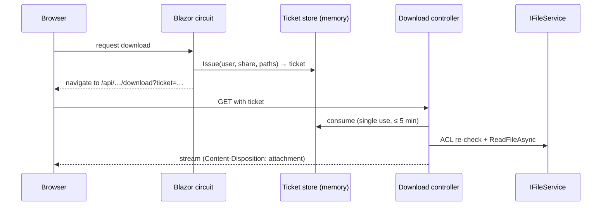

# Downloads and Share Links

The Web host serves file bytes to browsers through plain HTTP endpoints rather than through the
Blazor Server circuit, and exposes public download and upload links for anonymous visitors. This
document describes the ticket mechanism behind both and the share-link model.

Related: [REST API v1](rest-api.md) · [Security model](../architecture/security-model.md) ·
[Mail notifications](../subsystems/mail-notifications.md)

## Ticket-based downloads

Browser downloads never stream through the SignalR circuit. The authenticated circuit (which knows
the signed-in user) issues a **single-use, short-lived ticket**; the browser then fetches the bytes
from a controller with `?ticket=…`. The controller resolves the ticket back to user and paths and
re-checks access through `IFileService` before streaming.

| Endpoint | Ticket store | Content |
|---|---|---|
| `GET /api/files/download` | `FileDownloadTicketStore` | One file of a local share |
| `GET /api/files/download-zip` | `ZipDownloadTicketStore` | Several items streamed as a ZIP; access is re-checked per entry |
| `GET /api/public/download` | `PublicDownloadTicketStore` | Files of a public share link, streamed under the link creator's identity |
| `GET /api/cloud-access/download` | `CloudAccessDownloadTicketStore` | One file of a Cloud Access virtual share |
| `GET /api/database-backups/download` | `BackupDownloadTokenService` | A database backup archive (Data Protection-signed token, 2 min, single use) |
| `GET /api/system-logs/download` | – | Log archive export for authorized administrators |

The file, ZIP, public and Cloud Access tickets live in process-local `ConcurrentDictionary` stores
and expire after five minutes (`src/Kaimo_File_Server.Web/Services/*TicketStore.cs`).

## Share links

A `ShareLink` (`src/Kaimo_File_Server.Core/Domain/ShareLink.cs`, table `share_links`) grants
anonymous access to one subtree of a local share. `Kind` distinguishes **download** and **upload**
links; both share one entity, repository and policy code.

| Field | Download link | Upload link |
|---|---|---|
| Target (`ShareId`, `RootRelativePath`) | File or folder | Folder only |
| `PasswordHash` | Optional, BCrypt, throttled | Same |
| Start/end window, enabled flag | Yes | Yes |
| `MaxAccessCount` / `AccessCount` | Downloads | Uploaded files |
| `MaxBytesPerSecond` | Download rate | Upload rate |
| `MaxFileSizeBytes`, `MaxTotalBytes`, `UploadedBytes`, `AllowedExtensions` | – | Per-file limit, byte quota, allowed types |
| `BaseAddress` | Host used to build the public URL | Same |

### Tokens

- A link URL contains a random, URL-safe token. The database stores its **SHA-256 hash** for lookup
  and a copy encrypted with the Web host's Data Protection keys so the URL can be displayed again
  (`ShareLinkTokenProtector`). Without the key ring the link keeps working but its URL cannot be
  reconstructed.
- The public landing page `/shared/{token}` validates window, enabled state, share, creator and
  password on the circuit; only then does it issue a download ticket, so nothing sensitive is sent
  in the browser's GET request.
- Accesses are consumed atomically (`IShareLinkRepository.TryConsumeAccessAsync`), so concurrent
  visitors can never exceed `MaxAccessCount`.
- Every request is executed as the **link creator**: if the creator is disabled, loses permission,
  or the share is disabled, the link stops working.

### Upload links

Upload links implement a drop box (`src/Kaimo_File_Server.Web/Services/PublicUploadService.cs`):

1. The file name is stripped of any path, validated, and checked against `AllowedExtensions`.
2. The claimed size is checked against `MaxFileSizeBytes` and the global ceiling.
3. `TryReserveUploadAsync` reserves one file slot and the bytes in a single guarded
   `ExecuteUpdateAsync`, race-free across parallel visitors.
4. The upload streams over the circuit (`InputFile`) with the claimed size as a hard cap and the
   link's rate limit applied.
5. The target name is the first free `name (n).ext`; existing files are never overwritten.
6. `IFileService.WriteFileAsync` writes under the creator's identity (ACL check, versioning, change
   log). The storage layer publishes only complete files.
7. On failure or cancellation, `ReleaseUploadAsync` returns the reservation.

Visitors never see the folder's existing content. Each accepted upload is logged and can raise the
`sharelink.upload_received` notification.

### Settings and permissions

- Creating download links requires `ManageShareLinks`; upload links require the separate
  `ManageUploadLinks`. The creator must also hold the relevant file permission on the target
  (`CreateWriteData` for upload links).
- Upload links are globally switchable (`AllowUploadLinks`, default off) with a global per-file
  ceiling (`MaxUploadFileSizeBytes`, default and maximum 4 GiB). Switching them off stops existing
  upload links from accepting files.
