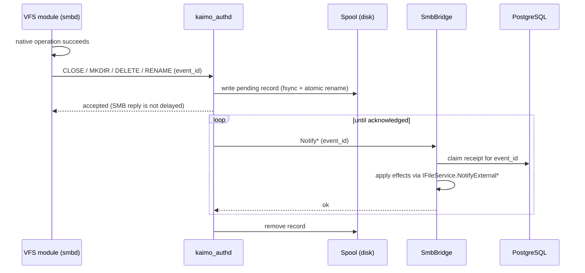
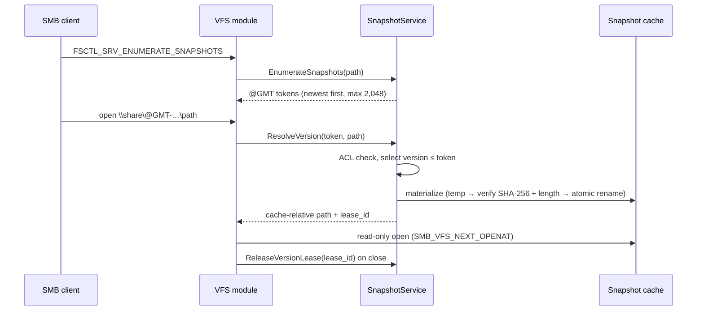

# SMB Lifecycle Events and Snapshots

Samba performs file operations natively and informs Kaimo afterwards so that versioning, ownership,
ACL path updates and the change log behave exactly as for web, WebDAV or API operations. In the
other direction, Kaimo's version history is exposed to SMB clients as Windows "Previous Versions".
This document describes both flows.

Related: [Samba VFS integration](samba-vfs-integration.md) ·
[Control plane (gRPC)](control-plane-grpc.md) ·
[Storage and persistence](../../architecture/storage-and-persistence.md)

## Lifecycle events

### Flow

| Event | Trigger | Effects in Kaimo |
|---|---|---|
| `NotifyClose` | A modified file is closed | New version (from the close capture), owner stamp, `Modified`/`Created` change-log entry |
| `NotifyMkdir` | Directory created | Owner stamp, `Created` change-log entry |
| `NotifyDelete` | File or directory permanently deleted | Metadata, ACL and version cleanup, `Deleted` change-log entry |
| `NotifyRename` | Rename/move, including moves into `.RECYCLE_BIN` | ACL and version paths follow the item, `Renamed` change-log entry |

The bridge creates its `IFileService` through the same `IFileServiceFactory` as the other hosts, so
results are identical to a web upload or rename (`src/Kaimo_File_Server.SmbBridge/Services/FileEventGrpcService.cs`).

### Durable spool

`kaimo_authd` keeps a disk spool at `/var/lib/kaimo/event-spool` (`src/samba-vfs/module/event_spool.h`):

- `pending/` holds events awaiting acknowledgement, `dead/` holds events that exhausted their retries.
- Records are written to a temporary file, `fsync`ed and atomically renamed; directories are synced.
- Delivery is retried with exponential backoff between `KAIMO_EVENT_RETRY_BASE_MS` (1 s) and
  `KAIMO_EVENT_RETRY_MAX_MS` (60 s), up to `KAIMO_EVENT_MAX_ATTEMPTS` (20), then the record moves to
  `dead/`.
- Capacity is bounded by `KAIMO_EVENT_MAX_PENDING` (100,000) and `KAIMO_EVENT_MAX_DEAD` (10,000).

### Idempotency

Every event carries a stable `event_id`. The bridge records processed IDs in
`samba_lifecycle_event_receipts` before applying effects, so a redelivered event is a no-op.
Handlers are additionally safe to repeat: a delete of an absent item succeeds, a rename that already
reached its destination succeeds, and a rename never deletes the destination's version history.
`SambaEventReceiptCleanupService` removes receipts older than `LifecycleEvents__ReceiptRetentionDays`
(30 days).

### Close capture

A version must reflect exactly what the closing handle wrote, not whatever is on disk when the event
is processed. Before closing, the VFS module captures the content behind the closing file descriptor
(not a reopened path) into the internal namespace `.kaimo-close-captures` of the share: a `FICLONE`
copy-on-write clone where the file system supports it, otherwise a `pread` copy that is rejected if
size or timestamps change during the copy. The capture ID travels with `NotifyClose`; the bridge
creates the version from the capture, binds it to the authenticated user and removes the capture.

### Recycle bin on SMB

`AuthorizeDelete` returns `recycle_delete = true` when the share has the recycle bin enabled and the
target is not already inside it. The VFS module then moves the item atomically (no replace) to
`.RECYCLE_BIN/<path>` (`src/samba-vfs/module/recycle_move.h`) and emits a rename event instead of a
delete event. Web, WebDAV, API and SMB therefore share one recycle bin.
On filesystems without `RENAME_NOREPLACE` (9p/drvfs under Docker Desktop, NFS, CIFS) the move
falls back to "refuse an existing target, then rename", which is not atomic but never replaces an
existing bin entry it can see. A failed recycle move is logged as `RECYCLE FAILED`; the SMB client
only sees a failed close, so the file stays in place.

The reply also carries `recycle_root_depth` (`ShareDefinition.RecycleRootDepth`): `0` places the bin
at the share root, `1` (home-folder share only) places it below the first path segment, so
`<userId>/a.txt` moves to `<userId>/.RECYCLE_BIN/a.txt`. The recycle root itself must already exist
and is never created; the VFS rejects any other depth (fail closed).

## Previous Versions (@GMT snapshots)

Kaimo stores versions as compressed, content-addressed blobs, which Samba's native
`vfs_shadow_copy2` cannot serve. The VFS module and the bridge's `SnapshotService` implement the
Windows "Previous Versions" protocol instead
(`src/Kaimo_File_Server.SmbBridge/Services/SnapshotGrpcService.cs`).

- **Enumeration** returns one @GMT token per version, at most the newest 2,048 labels. For folders,
  tokens are derived through `IFileService` so directory and per-child ACL checks apply.
- **Resolution** selects the newest version at or before the requested token. The user needs read
  permission on the file; folder projections contain only children the user may read.
- **Materialization.** Content is decompressed into
  `<cache-root>/<share-id>/<@GMT>/<user-id>/<path>`, verified against the stored SHA-256 and length in
  a temporary file and published atomically. Existing verified entries are reused. The historical
  modification time is applied so Windows distinguishes versions from the live file.
- **Isolation.** The cache root (`Snapshots__Cache__RootPath`, default
  `/data/kaimo-system/.kaimo-snapshots`) lies outside every share; overlapping configurations are
  rejected. Entries are partitioned per share and per user.
- **Read-only.** Snapshot opens are forced read-only in the VFS module; write, delete and rename
  on @GMT paths are denied.
- **Leases.** `ResolveVersion` returns a lease that keeps `SnapshotCacheCleanupService` from removing
  content in use; the module releases it when the handle closes.
- **Limits.** Per request: `Snapshots__Materialization__MaxFilesPerRequest` (10,000),
  `MaxBytesPerRequest` (1 GiB), `MaxDurationSeconds` (25), and `MaxConcurrentRequests` (2) overall.
  Cache: `Snapshots__Cache__TtlHours` (24), `MaxBytesPerShare` (5 GiB), swept every
  `SweepMinutes` (30). Options are validated at startup.
