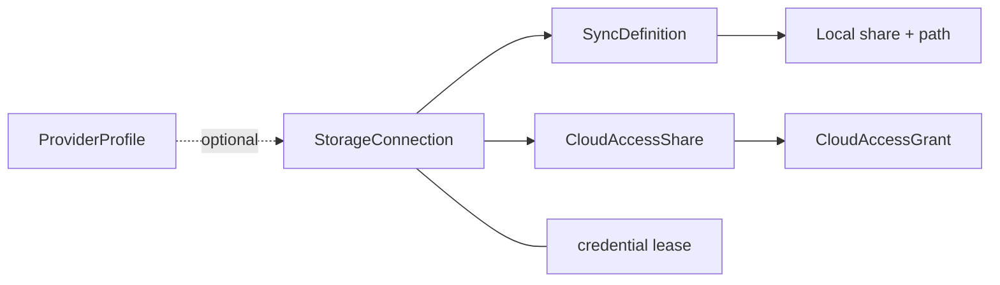
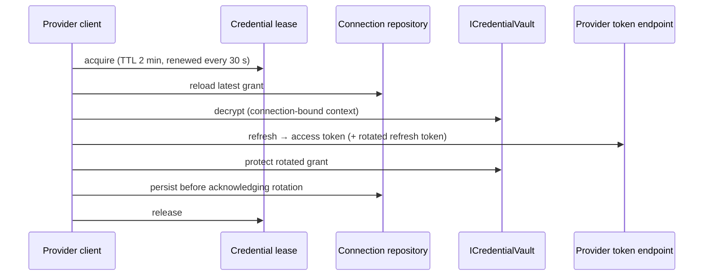

# Storage Connections and Credentials

A **storage connection** is the durable identity of one authorized account or endpoint at an
external provider (OneDrive, Google Drive, Dropbox, SMB, SFTP, rsync over SSH, WebDAV). Connections
are shared by server-side syncs and by Cloud Access virtual shares. This document describes the
connection model, the provider contracts, credential protection and the authorization runtime. All
external-storage code runs in the Web process.

Related: [Providers](providers.md) · [Sync engine](sync-engine.md) ·
[Virtual shares](virtual-shares.md) · [Security model](../architecture/security-model.md)

## Model

### `StorageConnection` (`storage_connections`)

Defined in `src/Kaimo_File_Server.Core/Domain/StorageConnection.cs`.

| Owns | Does not own |
|---|---|
| Stable ID, provider ID, display name, `AuthorizationMode`, optional `ProviderProfileId` | Local share or path |
| `EncryptedCredentialPayload` with `CredentialFormatVersion` and `ProtectorPurposeVersion` | Remote root of a particular consumer |
| Non-secret `SettingsJson` (host, port, remote root, pinned host key …) | Schedules, filters, bandwidth limits |
| Provider account, tenant and subject IDs; effective scopes | Virtual-share grants |
| `State`, `LastErrorCode`, verification and last-use timestamps | Live access tokens |
| `ConcurrencyVersion` (optimistic concurrency) | |

- **States:** `PendingConfiguration`, `PendingAuthorization`, `Ready`, `Degraded` (transient provider
  or network problem), `NeedsReauthorization` (terminal grant problem), `Disabled`.
- **Authorization modes:** `DeviceCode`, `DelegatedAuthorizationCode`, `ApplicationCredential`,
  `ServiceAccount`, `UsernamePassword`, `SshKey`, `HostMount`, `NetworkIdentity`.
- **Lifecycle:** reauthorizing replaces the grant but keeps the connection ID, so consumers stay
  attached. Deleting a connection is blocked while a sync definition or virtual share references it
  (repository check plus restrictive foreign keys).

### `ProviderProfile` (`provider_profiles`)

Deployment-level application identity and policy (for example a Microsoft public client or a
customer-owned Google OAuth client). It is not a user connection. Secrets of a profile are resolved
from files or environment variables, never stored in the database.

## Provider contracts

Defined in `src/Kaimo_File_Server.Core/Services/ExternalStorage/StorageProviderContracts.cs`:

| Contract | Purpose |
|---|---|
| `IStorageConnectionProvider` | Provider ID, display name, `StorageProviderCapabilities`, supported authorization modes; `OpenSessionAsync`, `TestAsync`, `RevokeAsync` |
| `IStorageSession` | An opened connection: exposes `IRemoteFileStore` and/or `IOptimizedStorageSync` according to its capabilities |
| `IRemoteFileStore` | Item-level operations: list, open read, write, create directory, delete, move |
| `IOptimizedStorageSync` | Bulk synchronization by a native tool (rsync) without item-level browsing |
| `IStorageDirectoryTargetResolver` | Folder selection and resolution for browse-capable providers |
| `IStorageConnectionProviderCatalog` | All registered providers |

`StorageProviderCapabilities` flags: `Browse`, `Read`, `Write`, `CreateDirectory`, `Delete`, `Rename`,
`Move`, `ServerSideCopy`, `Sync`, `StableItemIds`, `WatchChanges`, `DelegatedAuthorization`,
`ApplicationAuthorization`, `RequiresHostMount`, `OptimizedSync`, `DirectFileAccess`. Consumers check
capabilities instead of provider IDs; for example only `Browse`-capable providers can back a virtual
share.

## Credential taxonomy

| Class | Example | Where it lives |
|---|---|---|
| Provider application identity | Google client secret, Microsoft client ID override | Secret file or environment variable (`ExternalStorage__*`) |
| Connection grant | Refresh token, SSH private key, username/password | `StorageConnection.EncryptedCredentialPayload` |
| Access token | Graph or Google access token | Process memory only |
| OAuth transaction material | State, device code | `storage_authorization_transactions`, `storage_device_authorization_sessions` (hashed or Data Protection-encrypted) |
| Encryption root | Data Protection key ring and key-encryption certificate | `/data/kaimo-system` |

## Credential vault

`ICredentialVault` (`src/Kaimo_File_Server.Web/Services/DataProtectionCredentialVault.cs`) protects
connection grants with ASP.NET Core Data Protection. The protector purpose binds ciphertext to the
**connection ID, provider ID, credential kind and format version**, so ciphertext copied to another
connection does not decrypt. Payloads written in an older envelope version remain readable and are
re-protected by `CredentialRewrapService` in a bounded pass (at most 100 envelopes) at Web startup,
under the connection lease and with an optimistic concurrency check. A failed decrypt leaves the
original ciphertext untouched; the log reports counts only.

The same vault protects the SMTP password ([Mail notifications](../subsystems/mail-notifications.md)).

## Authorization runtime

| Table | Purpose | Sensitive-value handling |
|---|---|---|
| `storage_authorization_transactions` | Single-use hand-off between an authorized admin action and an OAuth endpoint | 256-bit browser token stored only as SHA-256 hash; consumed with a conditional `UPDATE` so exactly one callback wins |
| `storage_device_authorization_sessions` | Microsoft device code, context, expiry, poll interval and poll ownership | Device code and context Data Protection-encrypted; browser session ID hashed |
| `storage_connection_credential_leases` | Exclusive refresh/rewrap ownership per connection | Identifiers and expiry only |

Transactions and device sessions survive a Web restart. OAuth endpoints re-resolve the signed-in
actor and require the stored initiating user and department to match. Expired rows are removed
opportunistically.

### Token refresh sequence

Concurrent callers wait up to 30 seconds for an in-flight refresh. An abandoned lease can be
reclaimed after two minutes.

## Error handling

Raw provider response bodies never cross the provider boundary. `ProviderErrorSanitizer` extracts an
allow-listed provider error code and a stable category; `ProviderRequestException` carries only
provider ID, code, category and HTTP status. A shared redactor removes access and refresh tokens,
client secrets, device and authorization codes, assertions, passwords, private keys, bearer tokens
and JWT-shaped values from anything that might be logged. Helper processes' stdout/stderr (rsync,
smbclient) are never returned to callers.

## Permissions

| Permission | Allows |
|---|---|
| `ManageConnections` | Create, reauthorize, disable and delete connections |
| `UseConnections` | Select existing connections for syncs and virtual shares |
| `CreateSyncs`, `ConfigureSyncs`, `DeleteSyncs`, `SyncManually` | Sync definitions, checked against the scope of the local share |
| `ManageCloudAccess` | Virtual shares and their grants, checked against the share's department |

## Backup and restore

Connection grants are only decryptable with the Data Protection key ring and its key-encryption
certificate. The database and `/data/kaimo-system` must be backed up from the same point in time and
restored together; every Web instance must use the same key ring.
