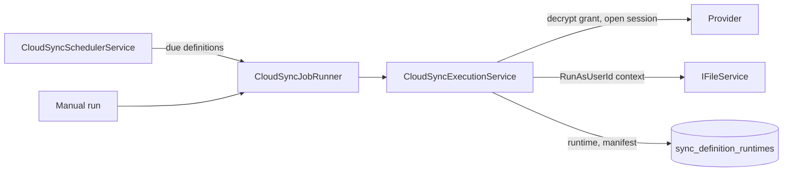

# Sync Engine

Server-side syncs mirror a folder of a local share with a folder behind a storage connection. They
run unattended in the Web process under the identity of a configured user, so every local write is
ACL-checked and recorded like any other file operation. Device ↔ server sync of the client apps is a
separate mechanism (see [Client Sync API](../external-access/sync-api.md)).

Related: [Connections and credentials](connections-and-credentials.md) · [Providers](providers.md) ·
[Background services](../architecture/background-services.md)

## Model

| Entity | Table | Content |
|---|---|---|
| `SyncDefinition` | `sync_definitions` | `ConnectionId`, `LocalShareId` + `LocalPath`, `RemotePath` (+ optional `RemoteProviderItemId`), `Mode`, `Schedule`, `AdvancedSettings`, `Enabled`, `RunAsUserId`, `MigrationSource` / `MigrationSourceChecksum` |
| `SyncDefinitionRuntime` | `sync_definition_runtimes` | Mutable run state: last run and last success, `CurrentJobId`, `LeaseOwner`, progress, sanitized `LastErrorCode`, per-item failures, `LastSyncManifest` |

Configuration and run state are separate so a running job never rewrites the configuration
aggregate. `(LocalShareId, LocalPath)` is unique. Both entities live in
`src/Kaimo_File_Server.Core/Domain/SyncDefinition.cs`.

**Modes** (`SyncMode`): `Pull` (remote → local), `Push` (local → remote), `TwoWay`.

**Advanced settings** (`CloudSyncAdvancedSettings`): maximum file size, excluded extensions,
upload and download bandwidth limits, and `SyncDeletions` (two-way only).

## Execution

1. **Scheduling.** `CloudSyncSchedulerService` evaluates enabled definitions. A schedule selects hours
   of the day (`ActiveSlots`, local server time) and an evaluation interval (1 s – 24 h, default 60 s).
   A successful run becomes eligible again after its interval has elapsed. Saving a definition wakes
   the scheduler immediately.
2. **Queueing.** Scheduled and manual runs go through the same `CloudSyncJobRunner`, which executes
   them off the request thread and reports progress.
3. **Coordination.** `DatabaseCloudSyncOperationCoordinator` keeps a per-share operation lease in
   `config_settings`, visible to Web and SmbBridge alike, so path edits, deletes and concurrent runs
   on the same share exclude each other. A run that finds the share busy is dropped (`Busy`); it
   never interrupts the running one. The lease is renewed every minute (lifetime 5 minutes) and has
   an absolute lifetime of 6 hours: a few minutes before that, while the lease is still valid, the
   running sync is stopped and ends as `Interrupted`. Such a run is neither recorded as failed nor
   notified; its last successful run stays unchanged, so the scheduler starts it again and the new run
   continues from the state already transferred. A sync whose heartbeat failed for longer than the
   lease lifetime (e.g. its process lost the database) may be taken over after expiry; it then stops
   the same way instead of overlapping with the new owner.
4. **Execution.** `CloudSyncExecutionService` (`src/Kaimo_File_Server.Infrastructure/Clouds/`) loads
   the definition, decrypts the connection grant, opens a provider session and runs the transfer as
   `RunAsUserId`. Browse-capable providers go through the generic engine
   (`ICloudConnection.SyncAsync`, with `RemoteFileStoreSyncAdapter` for protocol providers); rsync
   uses `IOptimizedStorageSync`.
5. **Completion.** Success updates only the runtime row. A run that finished but skipped individual
   items is recorded as completed with the item failures listed. Failures store an allow-listed
   provider code or the generic `sync_failed`; exception text is never persisted. Rotated provider
   grants are written to the connection before they are acknowledged.

Files written locally by a sync do not create file versions.

## Two-way reconciliation and deletions

Two-way sync compares both sides. An item present on only one side is ambiguous: newly created
there, or deleted on the other side. The engine resolves this with a **manifest** of share-relative
paths that existed after the last converged run (`SyncDefinitionRuntime.LastSyncManifest`).

- A manifest is built after every successful **TwoWay** and **Pull** run (pull uses it to tell
  remote-backed items from local-only ones).
- When `SyncDeletions` is enabled on a two-way sync, the previous manifest is consulted:

  | One-sided item in previous manifest? | Interpretation | Action |
  |---|---|---|
  | Yes | Deleted on the other side | Delete on this side too |
  | No | Newly created | Copy across |

- Without a stored manifest every one-sided item counts as new, so a first run can only copy, never
  mass-delete.
- A local deletion applied by the sync honors the share's recycle bin
  (`ShareDefinition.IsRecycleEnabled`). Remote deletions use the provider's delete; a provider that
  cannot delete fails the run instead of resurrecting the item.
- `.RECYCLE_BIN` and `.kaimo-*` entries are excluded from reconciliation (`ShareEntryPolicy`).

## Change detection and modification times

A file present on both sides is compared by modification time; the newer copy wins (Pull/Push
only ever transfer in their own direction).

- **Tolerance 2 s.** Times within 2 s count as equal, because Dropbox, SFTP v3 and WebDAV
  `getlastmodified` keep whole seconds (FAT two). Inside that window a **size mismatch** still
  counts as a change and the raw time order picks the direction. Accepted limit: an edit on both
  sides within 2 s that keeps the size is not detected until the next edit.
- **Pull** stamps the remote mtime on the local file. **Push** hands the local mtime to the
  provider: OneDrive, Google Drive and Dropbox (`client_modified`) store it; SFTP sets it after
  the upload; WebDAV sends a best-effort `PROPPATCH Win32LastModifiedTime` (honored by IIS and
  Kaimo, ignored by e.g. Nextcloud). Where the provider keeps the upload time instead (SMB,
  Nextcloud, legacy), a two-way run downloads a pushed file once more on the next run.
- **Dropbox lists `client_modified`** (the mtime the uploader set) instead of `server_modified`.
  Release note: files that came from the Dropbox desktop client and were pulled before this change
  still carry the newer `server_modified` locally, so a TwoWay/Push run re-uploads them once (no
  data loss; creates a new Dropbox revision). `client_modified` comes from the uploading client's
  clock.
- Creation times are not synchronized.

## Legacy import

Older installations stored sync mappings and provider grants as JSON inside
`ShareDefinition.CloudSettings`. `LegacyCloudSyncMigrationHostedService` runs once at Web startup,
before scheduled work, and for each legacy mapping atomically creates a `StorageConnection` with an
encrypted grant, a `SyncDefinition` and its runtime. The unique `(LocalShareId, LocalPath)` index and
the source checksum make the import restart-safe and convergent. Editing an imported definition
clears its `MigrationSource`; deleting one leaves a disabled tombstone so it is not re-imported.
Successful runs of imported definitions also update the legacy timestamp and grant for compatibility.
