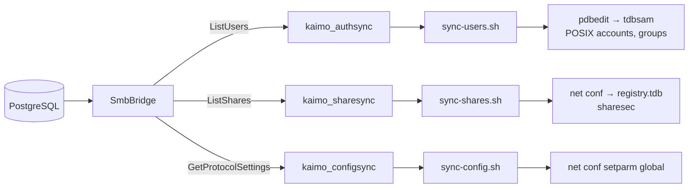

# SMB Control Plane (gRPC)

`Kaimo_File_Server.SmbBridge` is a .NET gRPC server that gives the Samba container access to Kaimo's
users, shares, ACLs, versions and settings. It is a thin facade over the Core services and contains
no business logic of its own. This document covers the transport, its security, the RPC contract and
the provisioning flow.

Related: [Samba VFS integration](samba-vfs-integration.md) ·
[Lifecycle events and snapshots](lifecycle-events-and-snapshots.md) ·
[Security model](../architecture/security-model.md)

## Transport

- Kestrel listens on port **5080**, HTTP/2 only, TLS with a **required client certificate**
  (`src/Kaimo_File_Server.SmbBridge/Program.cs`).
- The bridge is attached only to the internal networks `kaimo_smb_control` (towards Samba) and
  `kaimo_bridge_database` (towards PostgreSQL). It has no route to the outside.
- The bridge never migrates the database; it waits in `WaitForDatabaseReadyAsync` until the Host
  has finished.

### PKI

The one-shot `kaimo_smb_pki_init` service runs `src/samba-vfs/generate-control-plane-certs.sh` and
writes into `secrets/smb-control-plane/` (overridable with `KAIMO_SMB_CONTROL_PKI` for externally
managed certificates):

| Material | Subject | Usage | Mounted into |
|---|---|---|---|
| Control-plane CA | `CN=Kaimo SMB Control Plane CA` (10 years) | Signs both leaf certificates | Both (certificate only) |
| Server certificate | `CN=kaimo_smb_bridge`, SAN `DNS:kaimo_smb_bridge` (825 days) | `serverAuth` | Bridge |
| Client certificate | `CN=kaimo-samba` (825 days) | `clientAuth` | Samba |

`ControlPlaneTls` (`src/Kaimo_File_Server.SmbBridge/Security/ControlPlaneTls.cs`) validates client
certificates against the dedicated CA only; the operating-system trust store is not used.

### RPC allow-list

After the handshake, `ControlPlaneAuthorizationInterceptor` checks the certificate identity against
`ControlPlaneAccessPolicy` (`src/Kaimo_File_Server.SmbBridge/Security/ControlPlaneAccessPolicy.cs`).
The single client identity `kaimo-samba` may call every RPC listed below **except `GetNtHash`**;
NT hashes are exported only through the paged, rate-limited `ListUsers`.

## Contract

Single source: `src/samba-vfs/protos/kaimo_smb_bridge.proto`, package `kaimo.smb.bridge.v1`. It
generates the C# server stubs and the C++ clients.

| Service | RPC | Caller | Backed by |
|---|---|---|---|
| `AuthService` | `ListUsers` | `kaimo_authsync` | `IAuthenticationLookup` (active users, decrypted NT hashes) |
| | `GetNtHash` | – (not allow-listed) | `IAuthenticationLookup` |
| `AuthzService` | `AuthorizeConnect` | `kaimo_authd` | `IFileService` / `IAclService` share access, SMB and share enabled state |
| | `AuthorizeOpen` | `kaimo_authd` | ACL evaluation of the requested SMB access mask; returns the granted mask |
| | `AuthorizeDelete` | `kaimo_authd` | ACL `Delete` / parent `DeleteSubItems`; returns `recycle_delete` |
| | `AuthorizeRename` | `kaimo_authd` | Source delete, destination create, replaced-target delete in one decision |
| `EventService` | `NotifyClose`, `NotifyMkdir`, `NotifyDelete`, `NotifyRename` | `kaimo_authd` (spool) | `FileService.NotifyExternal*` (versions, ownership, ACL paths, change log) |
| `ShareService` | `ListShares` | `kaimo_sharesync` | `IShareRepository`, `HomeDirectoryService` |
| `ConfigService` | `GetProtocolSettings` | `kaimo_configsync` | `ISmbConfigStore` |
| `SnapshotService` | `EnumerateSnapshots`, `ResolveVersion`, `ReleaseVersionLease` | `kaimo_authd` | `IFileVersionService`, snapshot cache |

### Request validation

- Usernames and share names are validated (`SambaName`) and shares are resolved only when enabled
  (`EnabledShareResolver`).
- Every client path is normalized strictly (`ShareRelativePath.TryNormalizeStrict`) and contained in
  the share root. Client requests for the internal `.kaimo-*` namespaces are rejected.
- The raw SMB access mask is mapped bit by bit to `FilePermission`; generic and maximum-allowed bits
  are expanded first. The returned `granted_access_mask` never exceeds what the ACL allows.
- All RPCs honor gRPC cancellation.

## Provisioning plane

Three pull loops in the Samba container converge Samba's local state to the database. Each loop runs
a C++ client that fetches desired state as versioned JSON records, then a shell reconciler that
applies it idempotently, reads it back and reports freshness to the health check.

| Loop | Interval (default) | Applies |
|---|---|---|
| Users | `KAIMO_USER_SYNC_INTERVAL_SECONDS` (60) | Creates/updates POSIX accounts and `tdbsam` entries with the NT hash; locks and removes stale users; revokes their sessions |
| Shares | `KAIMO_SHARE_SYNC_INTERVAL_SECONDS` (2) | Adds, updates and removes registry shares (`path`, `browseable`, `guest ok = no`), writes `sharesec` for restricted shares, closes sessions on removed or moved shares |
| Protocol settings | `KAIMO_CONFIG_SYNC_INTERVAL_SECONDS` (2) | Min/max dialect, signing (`mandatory`/`auto`), encryption (`required`/`default`), WS-Discovery, audit logging, log level |

Registry configuration (`config backend = registry`, `registry shares = yes`) makes `smbd` read
changes live, without reload or restart.

### NT hash export

- Kaimo stores `MD4(UTF-16LE(password))` — identical to Samba's NT hash — AES-256-GCM encrypted in the
  database.
- `ListUsers` returns pages of 1–1,000 users (at most 100,000 in total). Page zero is charged against
  `HashExportRateLimiter`; follow-up pages require a short-lived, client-bound continuation token for
  exactly the next offset, so offsets cannot be used to bypass the limit. Excess exports fail closed.
- Hash buffers are cleared after copying on both sides. `sync-users.sh` stages credentials only in
  the private `tmpfs` at `/run/kaimo-user-sync` and imports all pages before applying any.

## Observability

The bridge writes to the shared log archive under source `smb-bridge`. Samba's own output is archived
under source `samba` by `kaimo-samba-log-forwarder.py`.
