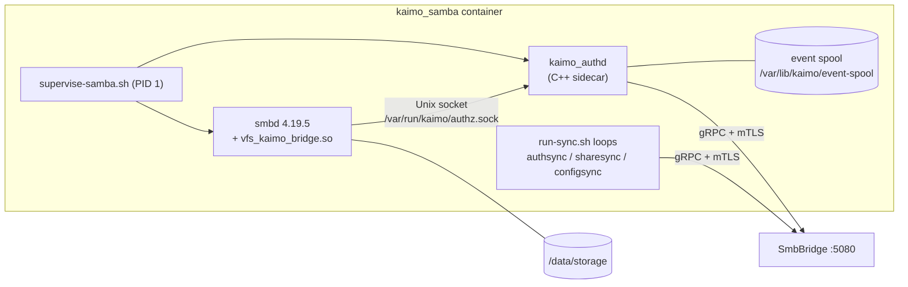

# Samba VFS Integration

SMB is served by a real Samba `smbd` in the `kaimo_samba` container. Samba owns the protocol and the
data path; Kaimo stays the source of truth for users, shares, ACLs, versions and search through a
custom VFS module that consults the .NET `SmbBridge` at the points where Kaimo must decide or be
notified. This document covers the Samba side and the local decision path.

Related: [Control plane (gRPC)](control-plane-grpc.md) ·
[Lifecycle events and snapshots](lifecycle-events-and-snapshots.md) ·
[Security model](../architecture/security-model.md)

Source: `src/samba-vfs/` (GPL-3.0-or-later; the rest of the repository is AGPL-3.0-or-later. The
two license domains meet only at the socket/gRPC boundary.)

## Division of responsibility

| Concern | Handled by |
|---|---|
| SMB2/3 protocol, signing, encryption, oplocks/leases, durable handles | Samba, natively |
| Raw read/write/seek/flush | Samba, directly on the mounted storage (`SMB_VFS_NEXT_*`) |
| NTLMv2 authentication | Samba, against NT hashes provisioned into `tdbsam` |
| Tree connect authorization | VFS `connect` hook → `AuthorizeConnect` |
| Open/create authorization and granted access mask | VFS `create_file` hook → `AuthorizeOpen` |
| Directory listing filter | VFS `readdir` hook → `AuthorizeOpen` (listing check, cached) |
| Delete and rename authorization, recycle-bin routing | VFS `unlinkat` / `renameat` hooks → `AuthorizeDelete` / `AuthorizeRename` |
| Versioning, ownership, change log after close/mkdir/delete/rename | VFS hooks → durable events → `EventService` |
| "Previous Versions" (@GMT) | `get_shadow_copy_data`, `stat`/`lstat`, `openat` → `SnapshotService` |
| Share list, protocol settings, user accounts | Periodic pull via the provisioning plane |

No file content ever crosses gRPC; the control plane carries only decisions and notifications.

## Container composition

| Component | Source | Role |
|---|---|---|
| `smbd` | Built from upstream Samba source (`Dockerfile.vfs`, `samba-build.env`) | Protocol and data path. Configuration in `conf/smb.conf.vfs` with `config backend = registry` |
| `vfs_kaimo_bridge.so` | `module/vfs_kaimo_bridge.c` | Pure C VFS module. Performs only short local-socket round trips; no gRPC, threads or forks inside `smbd` |
| `kaimo_authd` | `module/authd.cpp` | Translates local requests into gRPC calls, caches decisions, spools events |
| Sync clients | `module/authsync.cpp`, `sharesync.cpp`, `configsync.cpp` | Pull users, shares and protocol settings from the bridge |
| Reconcilers | `sync-users.sh`, `sync-shares.sh`, `sync-config.sh`, `run-sync.sh`, `sync-cycle.sh` | Apply pulled state idempotently and read it back |
| Supervisor | `supervise-samba.sh` | Starts `kaimo_authd` before `smbd`, couples their lifetimes, forwards signals, reaps children |
| Health checks | `authd-health.sh`, `smbd-health.sh`, `sync-health.sh` | Verify process identity via PID files, socket readiness, `smbcontrol smbd ping` and sync freshness without any SMB account |

### Pinned Samba build

VFS modules must match the exact `smbd` they are loaded into (`SMB_VFS_INTERFACE_VERSION`), and the
required internal headers exist only in the Samba source tree. The image therefore builds Samba
4.19.5 from a SHA-256-verified source archive under `/opt/samba` together with the module.
`samba-build.env` pins version, archive digest and VFS ABI (49). Two patches in `patches/` map a
denied tree connect to `NT_STATUS_ACCESS_DENIED` and lower the log level of control pings. The CI
workflow `.github/workflows/samba-vfs-compatibility.yml` builds the pinned stack and exercises every
hooked operation through `full_audit`.

## Hooks

| VFS callback | Local operation | Bridge RPC | Effect |
|---|---|---|---|
| `connect_fn` | `CONNECT` | `AuthorizeConnect` | Share access per Kaimo ACL; denied while SMB or the share is disabled |
| `create_file_fn` | `OPEN` | `AuthorizeOpen` | Sends the raw SMB `DesiredAccess` plus create intent; receives the granted (attenuated) access mask |
| `readdir_fn` | `OPEN` (listing) | `AuthorizeOpen` with `directory_listing` | Hides entries without read permission and the internal namespaces |
| `unlinkat_fn` | `DELETE_AUTH`, then `DELETE` | `AuthorizeDelete`, `NotifyDelete` | Authorizes; when the reply sets `recycle_delete`, moves to `.RECYCLE_BIN` instead of unlinking |
| `renameat_fn` | `RENAME_AUTH`, then `RENAME` | `AuthorizeRename`, `NotifyRename` | Authorizes source, destination and any replaced target in one decision |
| `mkdirat_fn` | `MKDIR` | `NotifyMkdir` | Ownership and change log for new directories |
| `close_fn` | `CLOSE` | `NotifyClose` | Versioning, ownership and change log for modified files |
| `get_shadow_copy_data_fn` | `SNAPSHOT_ENUMERATE` | `EnumerateSnapshots` | Lists @GMT tokens for "Previous Versions" |
| `stat_fn`, `lstat_fn`, `openat_fn` | `SNAPSHOT_RESOLVE` / `SNAPSHOT_RELEASE` | `ResolveVersion`, `ReleaseVersionLease` | Redirects timewarp paths to read-only snapshot cache content |
| `disconnect_fn` | – | – | Releases per-connection state |

## Local protocol (VFS ↔ authd)

Defined in `module/local_protocol.h`:

- Binary frames with a 12-byte envelope (magic `KAIM`, protocol version 4, operation, length),
  big-endian, followed by length-prefixed UTF-8 fields.
- Limits are checked before allocation: 8 KiB request payload, 64 KiB response payload, 32-byte
  usernames, 64-byte share names, at most 2,048 snapshot labels per enumeration.
- Operations: `CONNECT`, `OPEN`, `DELETE_AUTH`, `RENAME_AUTH`, `CLOSE`, `MKDIR`, `DELETE`, `RENAME`,
  `SNAPSHOT_ENUMERATE`, `SNAPSHOT_RESOLVE`, `SNAPSHOT_RELEASE`.
- Every round trip has a monotonic end-to-end deadline: `KAIMO_VFS_AUTH_TIMEOUT_MS` (default 6 s),
  `KAIMO_VFS_SNAPSHOT_TIMEOUT_MS` (32 s), `KAIMO_VFS_EVENT_TIMEOUT_MS` (250 ms).

### Socket trust

- The socket `/var/run/kaimo/authz.sock` is accessible only to the `kaimo-authd` group.
- `kaimo_authd` reads the peer's credentials with `SO_PEERCRED` and requires that the peer process is
  the trusted `smbd` executable (`KAIMO_AUTHD_PEER_EXECUTABLE`) and that the claimed username matches
  the authenticated peer.

### Sidecar behavior

| Aspect | Behavior | Setting (default) |
|---|---|---|
| Concurrency | Fixed worker pool with a bounded queue; overload is rejected, never queued without limit | `KAIMO_AUTHD_WORKERS` (16), `KAIMO_AUTHD_QUEUE_CAPACITY` (64) |
| I/O deadline | Per client socket | `KAIMO_AUTHD_IO_TIMEOUT_MS` (2000) |
| Decision cache | LRU bounded by entries and bytes, with TTL | `KAIMO_AUTHD_CACHE_MAX_ENTRIES` (10000), `KAIMO_AUTHD_CACHE_MAX_BYTES` (8 MiB), `KAIMO_AUTHD_CACHE_TTL_MS` (3000) |
| Failure mode | **Fail closed**: an unreachable bridge or sidecar denies | `KAIMO_AUTHZ_FAILOPEN` (0) |
| Events | Durable spool, retried until acknowledged | See [Lifecycle events](lifecycle-events-and-snapshots.md) |

## POSIX identity model

Every Kaimo user is provisioned as a local POSIX account in the container and added to the shared
storage group (`KAIMO_STORAGE_GROUP`, matching the storage GID) and the `kaimo-authd` group. Files and
directories are created group-writable (`create mask 0664`, `directory mask 2775` with setgid), so
all users share the same file-system permissions. **Per-user access control is therefore enforced
exclusively by the VFS hooks**; the POSIX layer only separates Kaimo from everything else on the
host.

Disabled or deleted users are locked (`nologin`), removed from the groups and from `tdbsam`, and
their open sessions are closed (`revoke-samba-sessions.sh`).

## Share visibility

- Shares are registry shares; their list comes from the bridge (`ListShares`).
- `ShareDefinition.IsShareHidden` maps to `browseable = no`.
- `access based share enum = yes` plus a share security descriptor (`sharesec`) restrict
  enumeration and connection for shares marked `restricted` (the user home share), granting exactly
  the users listed in `allowed_users`.
- For all other shares, enumeration is not filtered per user; the `connect` hook is the hard access
  check.

## Enabling and disabling

The SMB on/off switch (`services.smb.enabled`) is enforced by the bridge: while disabled,
`AuthorizeConnect` denies every tree connect and the share sync closes existing sessions. Disabling a
share or user likewise closes live handles through the reconcilers.
