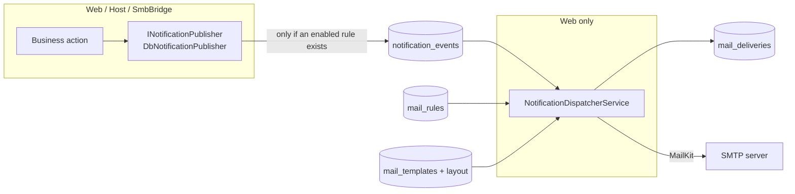

# Mail Notifications

Kaimo File Server sends e-mail notifications for selected events (a user was created, a file
arrived through an upload link, a sync failed, …). Any process can raise an event; delivery is a
transactional outbox drained by a single dispatcher in the Web process. Rules decide which event
sends which mail to whom; templates are Liquid and editable per language.

Related: [Background services](../architecture/background-services.md) ·
[Security model](../architecture/security-model.md)

## Architecture

### Publishing

`DbNotificationPublisher` (`src/Kaimo_File_Server.Infrastructure/Notifications/`) runs in every
process. It writes the event into `notification_events` only when at least one enabled rule exists
for its type (cached for 30 s). Failures are logged and swallowed, so a notification problem never
fails the business action. In read-only demo mode nothing is published.

### Dispatching

`NotificationDispatcherService` (`src/Kaimo_File_Server.Web/Services/Notifications/`) is registered
only in the Web process, because only the Web process holds the Data Protection keys to decrypt the
SMTP password (and the SmbBridge has no outbound network).

- Polls every 10 s and is woken immediately when the Web process itself published.
- Claims events with a 2-minute lease; a failed event is retried up to 5 times.
- Renders one `mail_deliveries` row per recipient once and stores it (audit and retry).
- An address receives the mail of one event only once, even if several rules match.
- Respects `MaxMailsPerMinute`. Failed deliveries are retried after 1, 2, 4 … minutes (capped at
  6 h); after 8 attempts, or on a permanent rejection, a delivery becomes `Dead`.
- While SMTP is disabled or incomplete, deliveries stay `Pending`.
- Finished events and sent or dead deliveries are pruned after 30 days.
- On start, it seeds one **disabled** default rule per catalog event that has never been seeded
  (`notifications.seeded_event_types`). Deleted default rules are not re-created.

Mail is sent with MailKit (`MailKitSmtpMailSender`); server certificates are always validated.

## Event catalog

Defined in `src/Kaimo_File_Server.Core/Services/Notifications/NotificationEventCatalog.cs`; typed
builders in `NotificationEvents` keep every call site to one line.

| Event | Raised by | Context roles | Default recipients |
|---|---|---|---|
| `user.created` | User administration | affected, actor | Affected user (no password in the mail) |
| `user.password_reset` | User administration | affected, actor | Affected user |
| `user.password_changed` | Self-service profile | affected | Affected user |
| `security.account_locked` | `MonitoredLoginService` (once per lock) | affected | Affected user + `ViewSecurityMonitor` holders, 60 min throttle |
| `sharelink.upload_received` | `PublicUploadService` | linkCreator | Link creator |
| `sharelink.accessed` | `PublicDownloadController` | linkCreator | Link creator, 60 min throttle |
| `sync.failed` | `CloudSyncExecutionService` | syncCreator | Sync creator + sync administrators, 6 h throttle |
| `sync.needs_reauthorization` | `CloudSyncExecutionService` | syncCreator | Sync creator + sync administrators, 24 h throttle |
| `backup.failed` / `backup.succeeded` | `DatabaseBackupService` (Host and Web) | – | `ManageBackups` holders |
| `device.registered` | `AuthApiController` (new device only) | affected | Device owner |
| `certificate.renewed` / `certificate.renewal_failed` | `CertificateRenewalService` | – | `ManageCertificates` holders |

## Recipients

A rule (`mail_rules`) lists any combination of:

- **context roles** of the event (affected user, triggering user, link creator, sync creator);
- **users** and **groups** (all enabled members);
- **permission holders**: every enabled user holding a management permission globally, directly or
  through a group (`ManagementAuthService.GetGlobalPermissionHolderUserIdsAsync`);
- **external addresses**.

Disabled users and users without a valid address are skipped; the result is de-duplicated.
Throttling is per rule, deduplication key (for example the locked account or the sync) and
recipient.

## Templates and layout

- Templates use **Liquid** (Fluid) with dotted placeholders such as `{{ user.displayName }}`.
  Common placeholders: `recipient.name`, `recipient.email`, `server.name`, `server.url`,
  `event.time`.
- Built-in defaults for English and German are C# constants in
  `src/Kaimo_File_Server.Infrastructure/Notifications/DefaultMailTemplates.cs`. A customization is
  stored in `mail_templates` per (event, language); removing it restores the built-in default.
- The layout (`notifications.layout` in `config_settings`) holds the logo (sent as an inline CID
  attachment), accent color and Liquid header/footer HTML.
- Mails are rendered in the application language (`app.language`).
- Rendering is sandboxed: templates see only string dictionaries, loops are bounded, values are
  HTML-encoded, and subjects are plain text with line breaks removed (no header injection).

## Security

- Event payloads and templates never contain passwords, tokens or link secrets.
- The SMTP password is stored through `ICredentialVault` (context `WellKnownGUIDs.SMTP_CREDENTIAL`),
  is write-only for administrators and never logged.
- `ManageMailServer` (SMTP settings) and `ManageNotifications` (rules, templates, delivery log) are
  separate permissions held by the built-in Administrator role; the system role NotificationManager
  carries `ManageNotifications` only.
- Throttling, the once-per-lock guard and `MaxMailsPerMinute` bound mail volume, for example when
  lockouts are provoked.

## Adding an event

1. Add a constant and a `NotificationEventDefinition` (category, context roles, placeholders with
   sample values, default recipients, throttle) to `NotificationEventCatalog`.
2. Add a typed builder to `NotificationEvents` (payload values only, never secrets; set a
   deduplication key when the event can repeat).
3. Add built-in templates for both languages to `DefaultMailTemplates` (a test enforces this).
4. Add `Notification_Event_<type>` and `…_Desc` (and a `Notification_Category_*` if needed) to both
   `.resx` files.
5. Call `await publisher.PublishAsync(NotificationEvents.YourEvent(...))` after the business action.
   Inject `INotificationPublisher?` as an optional dependency.

The dispatcher seeds a disabled default rule for the new event on the next start.

## Local testing

`docker-compose.dev.yml` contains Mailpit. Configure the SMTP server as host `mailpit`, port `1025`,
no encryption and no authentication, and read mails at <http://127.0.0.1:8025>.
