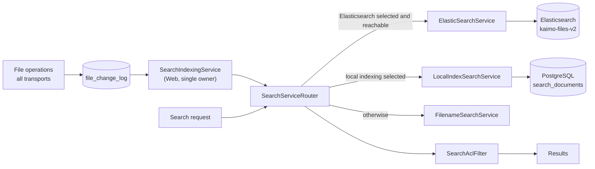

# Search and Indexing

Kaimo File Server searches file names and file content with one of two index engines, selected
under **Settings → Search**: Elasticsearch (separate container) or **local indexing** in the
application's PostgreSQL database. Exactly one engine is active; with neither selected — or with
Elasticsearch unreachable — search falls back to a file-name walk. Indexing is decoupled from file
operations: a single background indexer tails the change log, so no upload, rename or SMB close
ever waits on an index. Every result passes the same ACL filter.

Related: [Background services](../architecture/background-services.md) ·
[Storage and persistence](../architecture/storage-and-persistence.md) ·
[Search API](../external-access/search-api.md)

Source: `src/Kaimo_File_Server.Search/`, `src/Kaimo_File_Server.Infrastructure/Services/SearchIndexingService.cs`

## Components

| Component | Role |
|---|---|
| `SearchServiceRouter` | The `ISearchService` / `ISearchAdminService` every process resolves. Routes searches and index writes to the selected engine (`search.engine`): Elasticsearch when it also answers a ping, the local index unconditionally, otherwise the filename backend. A failing index search falls back to the filename backend |
| `ElasticSearchService` | Index management, document indexing, queries, full reindex |
| `LocalIndexSearchService` | Same contract over PostgreSQL via `ISearchIndexRepository` (`SearchIndexRepository` in Infrastructure); see [Local index](#local-index) |
| `SearchDocuments` | Conventions shared by both index engines: stable id `md5(absolutePath)`, directory documents, share resolution, reindex walk |
| `FilenameSearchService` | Walks every enabled share path and matches the query as a case-insensitive substring of the file name; skips hidden/internal folders and, unless requested, the recycle bin |
| `SearchAclFilter` | Reduces raw hits to items the caller may read (`ListReadData`), with one batched ACL query per share; hits in unresolvable or disabled shares are dropped (fail closed) |
| `ContentProvider` | Extracts text for indexing |
| `SearchIndexingService` | Tails `file_change_log` and applies index writes |

Registration: `AddElasticSearch` (`SearchServiceExtensions.cs`) is called before `AddCoreServices`,
so the router replaces the `NoOpSearchService` fallback. The Elasticsearch URL defaults to
`http://elasticsearch:9200`.

## Index

- Index name `kaimo-files-v2`. The suffix is versioned because analyzers are fixed when a field is
  created; changing an analyzer requires a new index.
- File names and content use an n-gram index analyzer (`kaimo_ngram_index`, 2–20 characters) and a
  whole-token search analyzer (`kaimo_ngram_search`), so a query matches substrings of words.
- The Host creates the index with the correct mapping at startup (`InitializeAsync`) before any
  document is written; otherwise Elasticsearch would auto-create it with a default mapping.
- Hidden paths (any segment starting with `.`: internal namespaces, version storage, `.git`, …) are
  never indexed (`ShareEntryPolicy.IsExcludedFromSearch`). The share's or home's own recycle bin is
  the exception: it is indexed, and searches leave it out unless asked for (see [Querying](#querying)).

## Engine selection

- `search.engine` in `config_settings` holds `Elasticsearch`, `Local` or `Filename`. While it is unset,
  the legacy flag `search.elasticsearch.enabled` decides (true → Elasticsearch, false → Filename);
  saving an engine also writes the legacy flag, so a downgrade keeps using Elasticsearch only when
  it was selected.
- Each index engine keeps its own change-log cursor (`search.index.cursor` for Elasticsearch,
  `search.local.cursor` for the local index). The inactive engine's index is kept and catches up from
  the log when it is selected again (or is rebuilt if the log was pruned past its cursor).
- Switching away from the engine a reindex runs for cancels that reindex.

## Local index

- Table `search_documents` (migration `AddLocalSearchIndex`) with trigram GIN indexes (`pg_trgm`)
  on `FileName` and `Content`, and `text_pattern_ops` b-tree indexes for prefix scans. `pg_trgm` is a
  trusted extension; external PostgreSQL servers need the `contrib` package, and the application's
  database user needs the `CREATE` privilege on the database. The migration runs for every
  installation, regardless of the selected engine, so without that privilege the app does not start.
- Query terms are runs of letters/digits (lowercased, at least 2 characters, at most 10). Each term
  matches as a case-insensitive substring (`ILIKE`) of the file name and — from three characters on —
  of the content; terms are OR-combined like the Elasticsearch `match` query. Ranking uses the
  Elasticsearch boosts: name 4, whole word in content 2, content substring 1. The excerpt is cut in
  SQL around the first content match, only for the returned page.
- Renames and directory moves are a single transaction that rewrites id (`md5()` in SQL), paths and
  share, and marks the moved rows as current, so a reindex running meanwhile does not sweep them;
  subtree deletes are one statement.
- Change detection: a document stores the file's size and last-write time; an unchanged file is only
  touched, not re-extracted, so a repeated reindex is cheap. A full reindex then sweeps documents of
  the walked shares that were not touched (files removed out of band).
- Until a full (all-shares) build has completed with the current `SearchConfigKeys.LocalIndexVersion`
  (`search.local.built-version` in `config_settings`), the indexer starts one whenever local indexing
  becomes active, so a first build interrupted by a restart or an engine switch is restarted instead
  of leaving the index incomplete. The log is followed meanwhile. Such a build first clears all
  change-detection stamps, so unchanged files are re-extracted too, and compacts the table
  afterwards (`VACUUM FULL`). Bump the version whenever extraction or the indexed path set changes.
- If the change log was pruned past an engine's cursor, the cursor only jumps to the head once the
  full rebuild has actually started; otherwise the indexer retries.
- In read-only demo mode (`KAIMO_DEMO_READONLY`) the local engine writes nothing and refuses a
  reindex; the demo index has to be built beforehand.
- Deliberate differences to Elasticsearch: no typo tolerance, no BM25 scoring, two-character terms
  match file names only, and stored content is capped at 1,000,000 characters.

## Indexing pipeline

1. Every mutation through `IFileService` (web, REST, WebDAV, SMB events via the bridge, syncs)
   appends to `file_change_log`. File operations do not call any index.
2. `SearchIndexingService`, registered only in the Web process, reads entries with `Seq` greater
   than the active engine's cursor in batches of 200 every 3 s, applies create/modify/delete/rename
   through the router and persists that cursor in `config_settings`.
3. While no index engine is active (or Elasticsearch is unreachable), the cursor is not advanced; the
   log buffers changes until the indexer catches up (bounded by the change-log retention window).
4. A single, `Seq`-ordered reader gives a total order, so create and delete of the same path cannot
   race.
5. Hidden paths are never indexed, the same rule the full reindex applies; the recycle bin is not
   hidden, so a delete to it or a restore from it is a plain rename. A move into a hidden folder
   removes the entry; a move out of one indexes the file fresh, or reindexes the share for a folder.
   Deletes of hidden paths are still applied.
6. The index is derived: a manual full reindex (`ReindexAllAsync`) rebuilds it from the file system
   and heals any lost or poisoned entry.

## Content extraction

`ContentProvider` (`ContentProivder.cs`) reads at most 25 MiB per file and extracts text by extension:

| Format | Extractor |
|---|---|
| PDF | PdfPig |
| `.docx`, `.docm`, `.xlsx`, `.xlsm`, `.pptx`, `.pptm` | OOXML part parsing (NPOI for Word documents) |
| `.xls` | NPOI HSSF |
| `.odt`, `.ods`, `.odp` | OpenDocument XML |
| Other | MIME sniffing; text is indexed, binary and archive types are indexed by name only |

A file that cannot be parsed (corrupt or encrypted) is still indexed by its name. Plain text is
stripped of encoded payloads first: runs of at least 60 base64 characters containing a digit
(encrypted vaults and backups, embedded attachments, keys) carry no searchable words but would
otherwise dominate the index size.

## Querying

- Search terms are used only in `match` queries (Elasticsearch) or as bound parameters with escaped
  LIKE wildcards (local index), never spliced into a query, and are not logged.
- Recycle-bin documents (any `.RECYCLE_BIN` segment) are left out unless the caller asks for them
  (`includeRecycleBin`, e.g. in the REST body) or the folder scope itself lies in a recycle bin. The
  web search bar always fetches them and its recycle-bin toggle only filters the shown hits, so it
  switches the results live without another query. Elasticsearch filters with a `regexp` `must_not` on
  `sharePath`, the local index with a case-insensitive regex on `SharePath`.
- Raw hits are ACL-filtered in pages (`SearchLimits`): paging stops after 50 readable hits or 1,000
  scanned raw hits, so restrictive ACLs do not produce an empty first page.
- Results carry share, share-relative path, name, type, size and highlighted snippet segments, never
  server paths or full indexed text.
- The REST endpoint `POST /api/v1/search` adds a per-user token-bucket rate limit and a 10-second
  time box; concurrent filename walks are capped process-wide.
