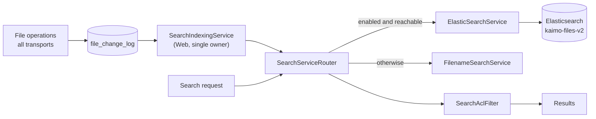

# Search and Indexing

Kaimo File Server searches file names and file content with Elasticsearch and falls back to a
file-name walk when Elasticsearch is disabled or unreachable. Indexing is decoupled from file
operations: a single background indexer tails the change log, so no upload, rename or SMB close
ever waits on Elasticsearch. Every result passes the same ACL filter.

Related: [Background services](../architecture/background-services.md) ·
[Storage and persistence](../architecture/storage-and-persistence.md) ·
[Search API](../external-access/search-api.md)

Source: `src/Kaimo_File_Server.Search/`, `src/Kaimo_File_Server.Infrastructure/Services/SearchIndexingService.cs`

## Components

| Component | Role |
|---|---|
| `SearchServiceRouter` | The `ISearchService` / `ISearchAdminService` every process resolves. Routes searches and index writes to Elasticsearch when it is enabled (admin flag) **and** answers a ping, otherwise to the filename backend |
| `ElasticSearchService` | Index management, document indexing, queries, full reindex |
| `FilenameSearchService` | Walks every enabled share path and matches the query as a case-insensitive substring of the file name; skips internal and recycle-bin folders |
| `SearchAclFilter` | Reduces raw hits to items the caller may read (`ListReadData`), with one batched ACL query per share; hits in unresolvable or disabled shares are dropped (fail closed) |
| `ContentProvider` | Extracts text for indexing |
| `SearchIndexingService` | Tails `file_change_log` and applies index writes |

Registration: `AddElasticSearch` (`SearchServiceExtensions.cs`) is called before `AddCoreServices`,
so the router replaces the `NoOpSearchService` fallback. The Elasticsearch URL defaults to
`http://elasticsearch:9200`.

## Index

- Index name `kaimo-files-v2`. The suffix is versioned because analyzers are fixed when a field is
  created; changing an analyzer requires a new index.
- File names and content use an n-gram index analyzer (`kaimo_ngram_index`, 2–20 characters) and a
  whole-token search analyzer (`kaimo_ngram_search`), so a query matches substrings of words.
- The Host creates the index with the correct mapping at startup (`InitializeAsync`) before any
  document is written; otherwise Elasticsearch would auto-create it with a default mapping.
- Internal namespaces, the recycle bin and version storage are never indexed.

## Indexing pipeline

1. Every mutation through `IFileService` (web, REST, WebDAV, SMB events via the bridge, syncs)
   appends to `file_change_log`. File operations do not call Elasticsearch.
2. `SearchIndexingService`, registered only in the Web process, reads entries with `Seq` greater
   than its cursor in batches of 200 every 3 s, applies create/modify/delete/rename to the index and
   persists the cursor in `config_settings`.
3. While Elasticsearch is disabled or unreachable, the cursor is not advanced; the log buffers changes
   until the indexer catches up (bounded by the change-log retention window).
4. A single, `Seq`-ordered reader gives a total order, so create and delete of the same path cannot
   race.
5. The index is derived: a manual full reindex (`ReindexAllAsync`) rebuilds it from the file system
   and heals any lost or poisoned entry.

## Content extraction

`ContentProvider` (`ContentProivder.cs`) reads at most 25 MiB per file and extracts text by extension:

| Format | Extractor |
|---|---|
| PDF | PdfPig |
| `.docx`, `.docm`, `.xlsx`, `.xlsm`, `.pptx`, `.pptm` | OOXML part parsing (NPOI for Word documents) |
| `.xls` | NPOI HSSF |
| `.odt`, `.ods`, `.odp` | OpenDocument XML |
| Other | MIME sniffing; text types are indexed, binary and archive types are skipped |

A file that cannot be parsed (corrupt or encrypted) is still indexed by its name.

## Querying

- Search terms are used only in `match` queries (no query-DSL injection) and are not logged.
- Raw hits are ACL-filtered in pages (`SearchLimits`): paging stops after 50 readable hits or 1,000
  scanned raw hits, so restrictive ACLs do not produce an empty first page.
- Results carry share, share-relative path, name, type, size and highlighted snippet segments, never
  server paths or full indexed text.
- The REST endpoint `POST /api/v1/search` adds a per-user token-bucket rate limit and a 10-second
  time box; concurrent filename walks are capped process-wide.
