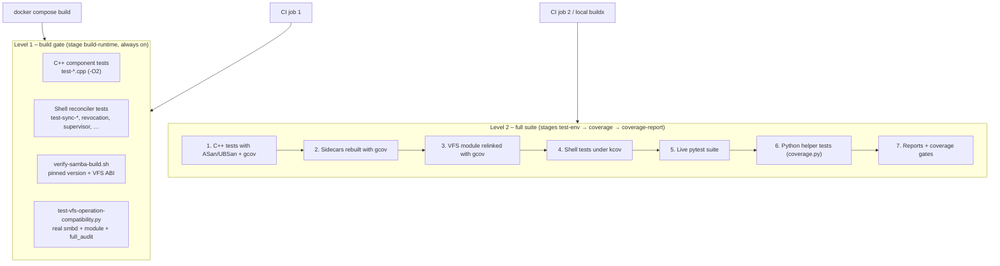

# Samba VFS Test Suite

How the `kaimo_samba` container is tested: which layers exist, what is real and what is faked in
each, how a failure is detected, how coverage is measured and enforced, and where the suite runs.
The companion document [Samba VFS test catalog](samba-vfs-test-catalog.md) lists *what* is caught,
scenario by scenario.

Related: [Samba VFS integration](../external-access/smb/samba-vfs-integration.md) ·
[Control plane (gRPC)](../external-access/smb/control-plane-grpc.md) ·
[Lifecycle events and snapshots](../external-access/smb/lifecycle-events-and-snapshots.md)

Source: `src/samba-vfs/tests/`. Command-line usage is kept short in the
[`src/samba-vfs/README.md`](../../src/samba-vfs/README.md) "Testing" section; this document
explains the design behind it.

## Scope

The suite covers everything that ships in the Samba image:

| Component | Source | Language |
|---|---|---|
| VFS module | `module/vfs_kaimo_bridge.c` | C (loaded by `smbd`) |
| Header libraries (protocol, decision logic, recycle, snapshots, close capture, …) | `module/*.h` | C / C++ header-only |
| Authorization sidecar `kaimo_authd` | `module/authd.cpp` | C++ |
| Provisioning clients `kaimo_authsync`, `kaimo_sharesync`, `kaimo_configsync` | `module/*sync.cpp` | C++ |
| Entrypoint, reconcilers, supervisor, health checks, PKI generator | `*.sh` | Bash |
| Log forwarder | `kaimo-samba-log-forwarder.py` | Python |

The .NET side (`SmbBridge`, `EventService`, `SnapshotService`, …) is **not** part of this suite;
it is covered by the solution's unit tests under `tests/`. Wherever the Samba side talks to .NET,
the suite substitutes a scriptable fake (see [Test harness](#test-harness)).

## Layout

```text
src/samba-vfs/tests/
├── run-suite.sh                 Full suite with coverage (steps 1–7 below)
├── quality-gates.json           Coverage minimums per area (the "ratchet")
├── kaimo_check.h                CHECK() assertion for the C++ tests
├── kaimo_testlib.py             Fake authd, private smbd, smbclient wrapper, protocol parser
├── kaimo_fakebridge.py          Fake gRPC SmbBridge with mTLS
├── test-*.cpp                   C++ component tests of the header libraries
├── test-*.sh                    Shell reconciler regressions (also run in the build gate)
├── test-authd-*.py              Self-contained authd runtime scripts
├── test-vfs-operation-compatibility.py   Live full_audit operation matrix (build gate)
├── live/                        pytest: live smbd + VFS module, real sidecars
│   ├── conftest.py              Fixtures: one smbd + fake authd per test module
│   ├── test_vfs_*.py            VFS module behaviour
│   ├── test_authd_bridge.py     Real kaimo_authd against the fake bridge
│   ├── test_sidecar_sync.py     Real *sync clients against the fake bridge
│   └── test_standalone_runtime.py   Runs the test-authd-*.py scripts inside pytest
├── shell/                       Further shell tests (entrypoint, health, PKI, config branches)
├── python/                      pytest for kaimo-samba-log-forwarder.py
└── tools/
    ├── build-vfs-module-coverage.py   Relinks only the VFS module with gcov
    ├── check-coverage.py              Merges coverage, writes summary.md, enforces gates
    └── gcov_flush_on_signal.h         Lets daemons write coverage data on SIGTERM
```

## Two levels



**Level 1 – build gate.** Part of the normal image build (`docker compose build kaimo_samba`).
Any failure breaks the image build, so a broken module can never be deployed. It is deliberately
fast: no instrumentation, no sanitizers. Every `tests/test-*.cpp` is compiled and run
automatically; a new C++ test file needs no Dockerfile change.

**Level 2 – full suite.** Runs [`tests/run-suite.sh`](../../src/samba-vfs/tests/run-suite.sh)
inside the test-only Dockerfile stages. These stages sit *before* the production `runtime` stage and
are only built when explicitly targeted, so nothing from them (compilers, kcov, test files,
instrumented binaries) can reach the production image. A full run takes about four minutes once
the Samba base layer is cached.

## What is real and what is faked

The guiding rule: **run the production binary wherever possible, and fake only the network
partner.**

| Layer | Real | Faked |
|---|---|---|
| C++ component tests | the header library code | nothing (pure functions, temp files) |
| Live VFS tests (`live/test_vfs_*.py`) | `smbd` 4.19.5, `vfs_kaimo_bridge.so`, `full_audit`, `smbclient` | `kaimo_authd` → `FakeAuthd` on the Unix socket |
| authd tests (`live/test_authd_bridge.py`) | `kaimo_authd` binary, Unix socket, event spool, mTLS | `smbd` → the test process speaks the local protocol; `SmbBridge` → `FakeBridge` |
| Sync client tests (`live/test_sidecar_sync.py`) | `kaimo_authsync` / `sharesync` / `configsync`, mTLS | `SmbBridge` → `FakeBridge` |
| Standalone runtime scripts (`test-authd-*.py`) | `kaimo_authd`, partly `smbd` | bridge unreachable on purpose |
| Shell tests | the installed scripts | Samba tools (`net`, `smbcontrol`, `pdbedit`, …) and sidecars → stub executables |
| Log forwarder tests | the forwarder module, imported | stdin/stdout, clock |

## Test harness

### `kaimo_testlib.py`

- **Protocol constants** are parsed at import time from
  [`module/local_protocol.h`](../../src/samba-vfs/module/local_protocol.h) (`#define`s and enum
  values). A protocol change in C therefore changes the tests automatically; there is no second
  copy of the protocol version that could drift.
- **`FakeAuthd`** – a thread-per-connection Unix socket server that speaks the `KAIM` framed
  protocol in place of `kaimo_authd`. Per operation it can be scripted to return:
  - `ALLOW` (with payload), `DENY`, `NOT_FOUND`, `OVERLOADED`, `UNAUTHORIZED_PEER`, `ERROR`;
  - deliberately malformed frames: wrong magic, version, kind or operation, oversized or truncated
    length, extra payload, raw bytes;
  - a **stall** (never answers) to exercise deadlines, or a **closed connection**;
  - a **`before` callback** that runs after the request arrived and before the answer is sent.
    This injects races deterministically (e.g. a file appears at the rename destination while the
    rename is being authorized).

  Every request is recorded with its decoded fields, so a test can assert *exactly* what the
  module asked (`s.authd.seen(P.OP_OPEN)`), not just the end result. The default handler is a
  permissive control plane: everything allowed, every event acknowledged.
- **`Samba`** – starts a private `smbd` with an isolated `smb.conf`, passdb and state directory,
  creates a throw-away user and wraps `smbclient`. Its log is read by tests to check the module's
  log markers (e.g. `CONNECT DENIED share=[data]`).

### `live/conftest.py`

- One `smbd` + `FakeAuthd` stack **per test module** (starting smbd costs ~0.3 s). The module
  reconnects to the authd socket on every call, so replies can be re-scripted between tests without
  restarting anything.
- The per-test fixture `s` gives every test an empty share, an empty snapshot cache, a reset fake
  and a fresh log mark (`s.new_log()` returns only this test's log lines).
- A test module changes the smbd environment by declaring `SAMBA_ENV = {...}` (e.g.
  `KAIMO_AUTHZ_FAILOPEN=1`, kill switches, deadlines; `None` removes a variable) and adds share names
  via `EXTRA_SHARES`.
- The share stacks `kaimo_bridge` *and* `full_audit`, so tests can also verify what the next VFS
  layer received.

### `kaimo_fakebridge.py`

- `make_pki` runs the **production** `generate-control-plane-certs.sh` and additionally issues a
  `localhost` server certificate from the same CA. The sidecars therefore run with real mTLS.
- `FakeBridge` serves every RPC of `protos/kaimo_smb_bridge.proto` through generic gRPC handlers
  (only `protoc --python_out` is needed). Handlers can return a reply, a sequence of replies, or
  abort with a gRPC status and trailing metadata (used for rate-limit hints). Every call is recorded.

### Trusted peer trick

`kaimo_authd` only trusts a root peer whose executable name matches its configured `smbd` path. In
`test_authd_bridge.py` the test process plays `smbd`, so `run-suite.sh` starts pytest with the
**resolved** interpreter (`python3.12`, not the `python3` symlink) and authd is configured to trust
that executable. When running live tests by hand, use `python3.12` for the same reason.

## How a failure becomes visible

| Mechanism | Where | Effect |
|---|---|---|
| `CHECK(expr)` ([`kaimo_check.h`](../../src/samba-vfs/tests/kaimo_check.h)) | C++ tests | Prints file/line/expression and aborts. Unlike `assert`, never compiled out, so side-effecting checks always run. |
| AddressSanitizer / UndefinedBehaviorSanitizer | C++ tests (level 2) | Memory errors, leaks and UB abort the test (`-fno-sanitize-recover=all`, `detect_leaks=1`). |
| pytest assertions | live and Python tests | Assert on client result (NT status), file system state, recorded authd/bridge requests **and** module log markers. Failure messages include smbd log and authd requests (`s.details(...)`). |
| Shell `check` / `expect_fail` / `PASS:` | shell tests | Non-zero exit with the failing description and captured output. |
| `xfail(strict=True)` | known findings | The test is *expected* to fail. If the code gets fixed, the unexpected pass fails the suite until the marker is removed (see [Known findings](#known-findings)). |
| Coverage gates | step 7 | An area below its minimum in `quality-gates.json` fails the suite. |
| `status.txt` | report output | `passed`, or `failed: <step names>`. CI takes its verdict from this file. |

`run-suite.sh` collects failures instead of aborting at the first one, so reports are always
produced. It exits non-zero on any failure unless `KAIMO_SUITE_SOFT_FAIL=1` is set (CI sets it,
exports the reports, and then fails the job from `status.txt`).

Most assertions check **three things at once**: the client-visible result (e.g.
`NT_STATUS_ACCESS_DENIED`), the side effect on disk (file still there, nothing created), and the
reason in the log (e.g. `malformed OPEN authorization response, denied`). The log marker matters:
it proves the request was rejected for the intended reason and not by some unrelated layer.

## Coverage instrumentation

Each artifact is instrumented with the tool that fits it. None of this touches production
binaries.

| Artifact | How it is instrumented |
|---|---|
| C++ component tests | Compiled with `--coverage -O0` plus ASan/UBSan. |
| `kaimo_authd`, `kaimo_*sync` | Recompiled with `--coverage` and installed over the build-gate binaries inside the test image. [`gcov_flush_on_signal.h`](../../src/samba-vfs/tests/tools/gcov_flush_on_signal.h) is force-included: daemons stop on `SIGTERM` without running exit handlers, so this header dumps the gcov counters first. |
| `vfs_kaimo_bridge.so` | [`build-vfs-module-coverage.py`](../../src/samba-vfs/tests/tools/build-vfs-module-coverage.py) captures waf's exact compile and link commands for this one target (`waf -v`), replays them with `--coverage -O0`, and replaces the installed module. Rebuilding all of Samba with `--enable-coverage` is avoided. Output directories are made world-writable because smbd children drop privileges before writing `.gcda` files. |
| Shell scripts | Every installed script is replaced by a small wrapper that `exec`s `kcov` around the pristine copy. Nested calls (`run-sync.sh` → `sync-users.sh`, …) are therefore traced too. |
| Python helpers | `coverage.py` with branch coverage. |

Reports are produced by `gcovr` (C/C++), `kcov --merge` (Bash) and `coverage.py` (Python), then
merged by [`check-coverage.py`](../../src/samba-vfs/tests/tools/check-coverage.py).

### Report output

```text
coverage-out/
├── summary.md              Coverage per area and per file, threshold failures
├── status.txt              "passed" or "failed: <steps>"
├── gcovr/index.html        C/C++ line + branch report (also cobertura.xml, summary.json)
├── kcov/merged/index.html  Bash report (also kcov/cobertura.xml)
├── python/html/index.html  Python report (also coverage.json)
└── junit/                  live.xml, python.xml
```

## Quality gates (coverage ratchet)

[`tests/quality-gates.json`](../../src/samba-vfs/tests/quality-gates.json) defines one minimum
per area. The minimums sit just below the measured values, so coverage can only go up:

| Area | Files | Measured 2026-10-04 (line / branch) | Minimum (line / branch) |
|---|---|---|---|
| VFS module | `vfs_kaimo_bridge.c` | 76.6 % / 48.0 % | 75 / 46 |
| Header libraries | `module/*.h` | 90.4 % / 76.7 % | 89 / 75 |
| authd sidecar | `authd.cpp` | 87.8 % / 70.7 % | 86 / 69 |
| Sync clients | `authsync.cpp`, `sharesync.cpp`, `configsync.cpp` | 94.2 % / 93.1 % | 93 / 91 |
| Shell scripts | `*.sh` | 76.1 % / – | 75 / – |
| Python helpers | `*.py` | 99.3 % / 97.8 % | 98 / 96 |

This table is a snapshot. The authoritative minimums are the ones in `quality-gates.json`, and the
current measured values are in `summary.md` of the latest run (CI job summary or local
`coverage-out/`). Whenever a minimum is raised, update the "Measured" and "Minimum" columns
here in the same change and adjust the date in the column header.

For comparison, before this suite existed the estimated coverage was about 35–40 % for the VFS
module, about 67 % for the header libraries, about 55 % for the shell scripts and 0 % for authd,
the sync clients and the log forwarder.

Rules:

- **Raise** a minimum when coverage has grown. **Never lower** one to make a change pass; add tests
  instead.
- An area for which no coverage data was found at all fails as well (protects against a silently
  broken instrumentation step).
- `"report_only": true` turns the gates into a report without failing; it is `false` and is meant
  to stay so.

The gate was verified to bite: with a minimum temporarily raised to 95 %, the check fails.

## Continuous integration

[`.github/workflows/samba-vfs-compatibility.yml`](../../.github/workflows/samba-vfs-compatibility.yml)
runs on every push and pull request to `master` that touches `src/samba-vfs/**` or the workflow
itself, and can be started manually.

| Job | What it does |
|---|---|
| 1. *Pinned source, VFS ABI, and live operation matrix* | Builds the `build-runtime` stage, i.e. Level 1. Populates the GitHub Actions cache with the Samba build. |
| 2. *Full test suite and coverage gates* (needs job 1) | Builds `coverage-report` with `KAIMO_SUITE_SOFT_FAIL=1`, reusing job 1's cache. Appends `summary.md` to the job summary, uploads `coverage-out/` as artifact `samba-vfs-test-reports` (14 days), then fails unless `status.txt` is `passed`. |

The summary and the artifact are published even when tests fail, so a red build always comes with
the reports needed to diagnose it.

## Running locally

Only Docker is required. From `src/samba-vfs/`:

```bash
docker buildx build -f Dockerfile.vfs --target coverage-report --output type=local,dest=./coverage-out .
```

For fast iteration build the `test-env` stage once and mount the test tree, then run a single file:

```bash
docker buildx build -f Dockerfile.vfs --target test-env --load -t kaimo-samba-test .
docker run --rm -v "$PWD/tests:/opt/kaimo-tests/tests" kaimo-samba-test \
  bash -c 'cd /opt/kaimo-tests/tests && python3.12 -m pytest -q live/test_vfs_connect.py'
```

Changes to tests are picked up without rebuilding; changes to production sources (module,
sidecars, scripts) need the `test-env` image to be rebuilt.

## Known findings

Two defects in production code were found while writing the suite. They are recorded as tests
marked `xfail(strict=True)`; the reason is in the marker.

| Finding | Test | Impact |
|---|---|---|
| A read-only grant does not stop truncation. When authd attenuates an open to read access, a client that opens with disposition `FILE_OVERWRITE_IF` (e.g. `smbclient put` onto an existing file) still gets the file truncated to 0 bytes before the write is rejected. `kaimo_create_file` must deny overwrite/supersede dispositions when the granted mask lacks `FILE_WRITE_DATA`. | `live/test_vfs_files.py::test_read_only_grant_prevents_truncation` | **Security**: data loss by a user who only has read permission. |
| Samba 4.19 creates directories under a temporary name (`.::TMPNAME:D:…:<name>`) and then renames them. The `mkdirat` hook reports that internal path to the bridge as a `MKDIR` lifecycle event. | `live/test_vfs_files.py::test_mkdir_never_reports_samba_temporary_names` | Wrong path in the change log / events. |

When a fix lands, the corresponding test starts passing, `strict=True` turns that into a failure,
and the `xfail` marker must be removed in the same change.

## Known gaps

- **`supervise-samba.sh` runs without kcov** (`KCOV_EXCLUDE` in `run-suite.sh`). Its test sends
  signals to the script's PID and inspects its descriptors; a tracing parent process would change
  what the test observes. The script is still *tested*, it is just not counted in shell coverage.
- **About 23 % of `vfs_kaimo_bridge.c` is not executed.** These are mostly allocation-failure and
  error paths (`talloc` failures, unexpected `errno` from the next VFS layer) that cannot be
  triggered reliably over SMB. The decision logic itself was moved into header libraries precisely
  so it can be tested exhaustively there.
- **Not automated:** Windows Explorer "Previous Versions" UX, broad client interoperability and
  revocation timing remain manual release checks.

## Production code changes made for testability

Both changes behave exactly as before in production.

- **`vfs_kaimo_bridge.c`** – pure decision logic was extracted into header libraries that have no
  Samba dependency and are unit tested individually:

  | Header | Logic |
  |---|---|
  | `authz_reply.h` | Which response frames are acceptable, how an authorization reply decodes, final allow/deny per verdict and fail mode |
  | `snapshot_access.h` | `SNAPSHOT_RESOLVE` reply decoding, cache-relative path validation, lease scope, read-only open flags |
  | `close_capture.h` | Capture ID, stable-source check, chunked copy, atomic no-replace publish |
  | `vfs_env.h` | Parsing of deadline values and kill switches from the environment |

  In addition, a `_Static_assert` fails the build if the pinned Samba's `FILE_GENERIC_ALL` ever
  differs from the access-mask contract (`KAIMO_SAMBA_SPECIFIC_ACCESS`), and the module logs a build
  marker (`kaimo_bridge build [...] loaded`) that the build gate and the live tests check, so a
  stale module cannot go unnoticed.
- **`entrypoint.vfs.sh`** – the helper script directory, the number and interval of initial
  convergence attempts, and the PID that is terminated on fatal revocation failure can be
  overridden (`KAIMO_ENTRYPOINT_SCRIPT_DIR`, `KAIMO_INITIAL_SYNC_ATTEMPTS`,
  `KAIMO_INITIAL_SYNC_RETRY_SECONDS`, `KAIMO_ENTRYPOINT_UNIT_PID`). Defaults are unchanged
  (`/usr/local/bin`, 30 × 2 s, PID 1).

## Adding a test

| You want to test … | Put it in … | Notes |
|---|---|---|
| Pure logic (parsing, validation, decisions) | a header in `module/` + `tests/test-<name>.cpp` | Picked up automatically by the build gate and the full suite. Use `CHECK`. |
| VFS behaviour seen by an SMB client | `tests/live/test_vfs_<area>.py` | Script replies with `s.authd.on(...)`; assert NT status, disk state, recorded requests and log marker. Use a new module with `SAMBA_ENV` if smbd needs a different environment. |
| authd or sync client behaviour | `tests/live/test_authd_bridge.py`, `tests/live/test_sidecar_sync.py` | Script the bridge with `bridge.on(...)` / `bridge.on_sequence(...)`. |
| A shell script | `tests/shell/test-<name>.sh` | Runs automatically in the full suite with `KAIMO_SCRIPTS_DIR` / `KAIMO_SCRIPT_SOURCES` set. Add it to the Dockerfile build gate only if it is cheap and essential. |
| The log forwarder | `tests/python/test_*.py` | Measured with branch coverage. |
| A newly discovered defect | the matching file, marked `xfail(strict=True, reason="FINDING: …")` | Remove the marker together with the fix. |

Afterwards run the full suite. If coverage went up noticeably, raise the affected minimum in
`quality-gates.json` and update the [quality gates table](#quality-gates-coverage-ratchet) above.
If the new test covers a new scenario, add a row to the
[test catalog](samba-vfs-test-catalog.md) as well.
